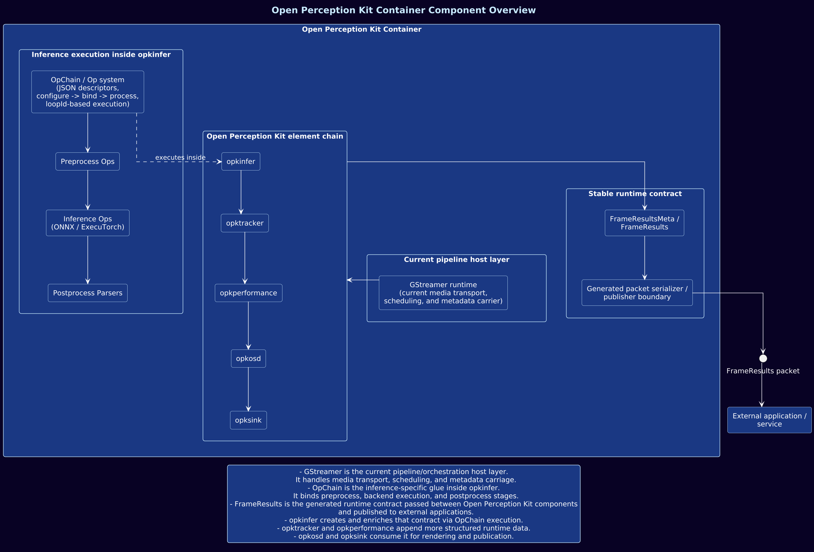
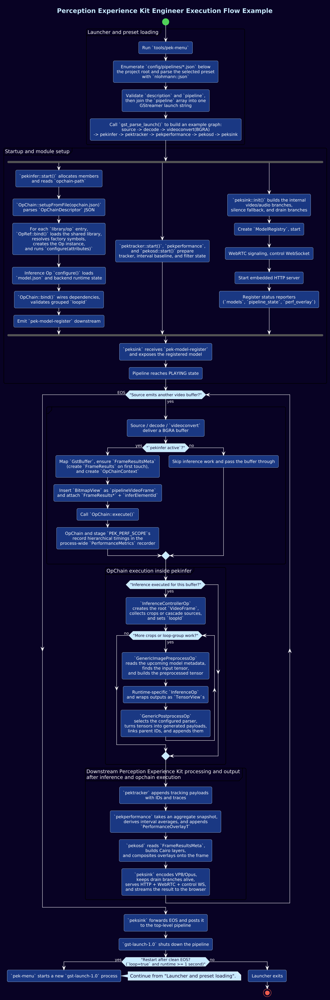

<!--
SPDX-FileCopyrightText: Copyright 2026 Arm Limited and/or its affiliates <perception-fdbck@arm.com>
SPDX-License-Identifier: Apache-2.0

Licensed under the Apache License, Version 2.0 (the "License");
you may not use this file except in compliance with the License.
You may obtain a copy of the License at

    https://www.apache.org/licenses/LICENSE-2.0

Unless required by applicable law or agreed to in writing, software
distributed under the License is distributed on an "AS IS" BASIS,
WITHOUT WARRANTIES OR CONDITIONS OF ANY KIND, either express or implied.
See the License for the specific language governing permissions and
limitations under the License.
-->

# Architectural Overview

OPK uses GStreamer as the media pipeline host while keeping
its inference execution model organized around reusable OpChains and structured
`FrameResults` metadata. GStreamer delivers media buffers and schedules elements;
OPK elements process those buffers, enrich metadata, and expose results for
rendering, streaming, or application use.

## Component View

The runtime is built around `FrameResults` as the shared data contract. `opkinfer`
creates and enriches it through OpChain execution, `opktracker` and
`opkperformance` can append runtime data, `opkosd` consumes it for overlays, and
application-facing boundaries can serialize it for external consumers.

## Activity View

The activity view traces the path from `opk-menu` preset parsing through element
initialization and into the steady-state per-buffer execution path.

## Execution Model

The internal processing model is based on Ops and OpChains. An `Op` is a
processing unit with a defined lifecycle, and an `OpChain` is an ordered set of
Ops used for preprocessing, inference, postprocessing, or other local processing
steps. OpChains are configured from JSON and can run inside `opkinfer` or outside
GStreamer. See [Op system](op-system.md) and [OpChain Context](op-chain-context.md).

Runtime configuration describes the selected OpChain, Op attributes, model and
backend choices, thresholds, parser settings, and cascade behavior. This keeps
pipeline composition and model swapping in configuration instead of requiring a
rebuild for common changes.

## FrameResults Data Model

The Open Perception Kit schema defines `FrameResults`, the persistent runtime
result envelope. It travels downstream with the media buffer and aggregates
typed payloads produced by postprocessing, tracking, and performance elements.
This supports cascades, parallel branches, and incremental enrichment across the
pipeline. See
[FrameResults schema](perception.md).

## End-to-End Flow

A typical execution flow:

1. GStreamer delivers an audio or video buffer into the pipeline.
2. `opkinfer` executes an OpChain whose Ops record hierarchical timing scopes in
   process-wide `PerformanceMetrics`.
3. Results are appended to `FrameResults` as typed schema payloads.
4. `opktracker` can stabilize detections across frames and append tracking output.
5. `opkperformance` reads interval aggregates and appends `PerformanceOverlayT`.
6. `opkosd` can draw supported `FrameResults` payloads onto video frames.
7. `opksink` can stream the output to a browser through WebRTC.

This keeps the pipeline modular while allowing the core inference execution model
to remain reusable outside GStreamer.
