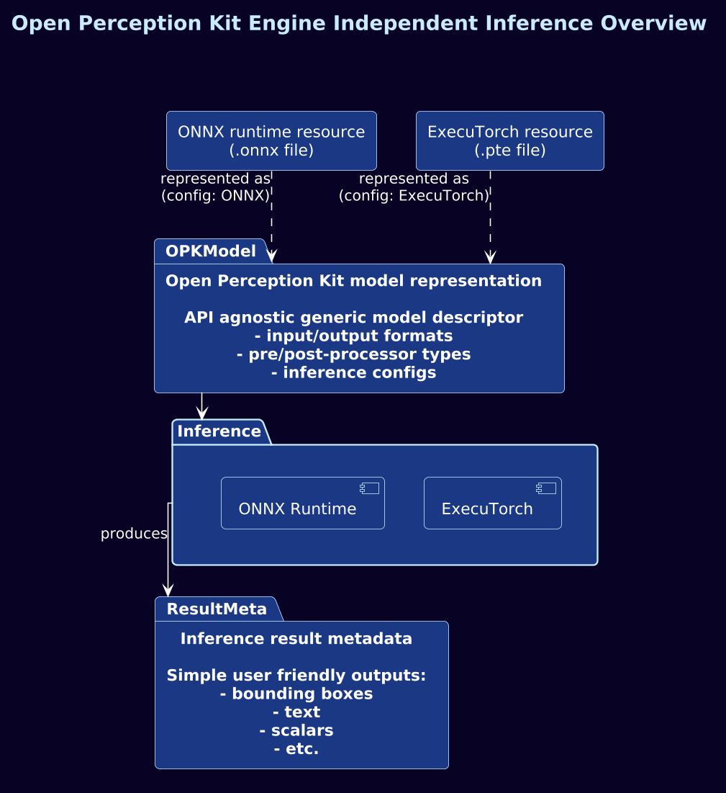

# Inference Execution Flow

OPK separates engine-specific model loading and inference execution from generic
preprocessing, tensor handling, postprocessing, and `FrameResults` output.
Backend-specific code lives in separate shared libraries so SDK dependencies stay
isolated from the core runtime.



## Flow

1. The selected backend loads the model file and extracts metadata such as tensor
   names, shapes, element types, and quantization parameters.
2. Backend metadata is converted into the engine-agnostic `opk::Model` runtime
   representation.
3. Generic preprocessing builds input tensors using model input metadata,
   `DataKind`, `Shape`, and quantization/normalization values.
4. The backend-specific inference Op calls the runtime and writes raw output
   tensors.
5. Generic postprocessing wraps those outputs in `TensorView`, parses them, and
   appends structured schema payloads to `FrameResults`.

```text
engine-specific load
  -> opk::Model
  -> generic preprocessing
  -> engine-specific inference execution
  -> generic postprocessing
```

## Design Principle

Inference engines are responsible for loading models and executing the forward
pass. Preprocessing, postprocessing, result formatting, and OpChain structure stay
generic. This allows backend swapping without rewriting parser logic or changing
the surrounding OpChain contract.
