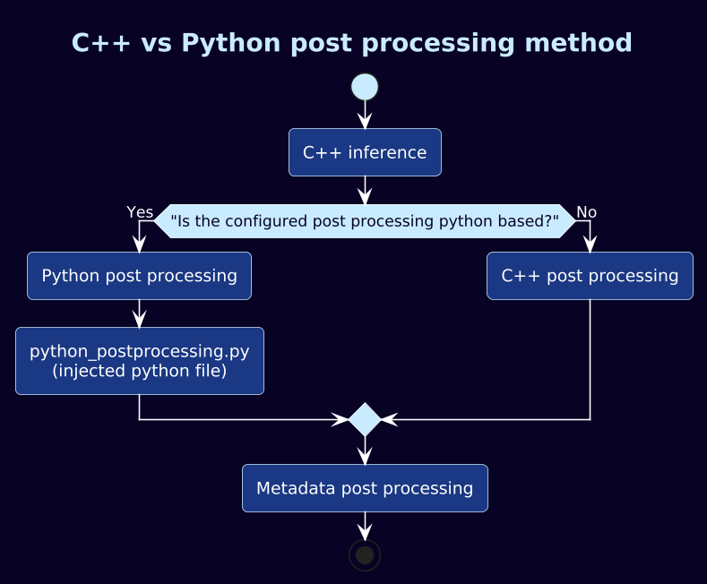

# TensorParser

`TensorParser` is the interface for converting raw inference output tensors into
structured `Perception` metadata. Parsers are backend-agnostic: they interpret
model-specific output layouts, not backend execution details.

## Purpose

Inference runtimes produce numeric tensors. A parser turns those tensors into
framework-level results such as detections, classifications, segmentation maps,
text regions, gaze vectors, or embeddings.

Typical parser responsibilities are:

- read output tensors through `TensorView`
- use `InferenceInfo` for coordinate and provenance context
- decode model-specific tensor layouts
- write structured results into a `Perception::Layer`
- return explicit success or failure

Parsers must not own or modify tensor memory.

## Execution Contract

`parse(const Input&, Perception::Layer&)` receives the tensor outputs, parser
attributes, inference context, and destination layer. The parser writes only the
structured metadata that belongs to that inference step.

This keeps inference execution, tensor interpretation, and downstream metadata
transport separated.

## Extension Model

Default C++ parsers live under `development/ops-std/postproc/` and are selected
by name from `GenericPostprocessOp`. Treat that directory as the source of truth
for the current parser set.

Adding a parser normally means:

1. Add a parser class implementing the `TensorParser` contract.
2. Register it with `GenericPostprocessOp`.
3. Reference it from the model or OpChain configuration.
4. Add focused tests using known output tensors and expected `Perception` layers.

Python-based postprocessing is not part of the current runtime. See
[Known Limitations](known-limitations.md).

