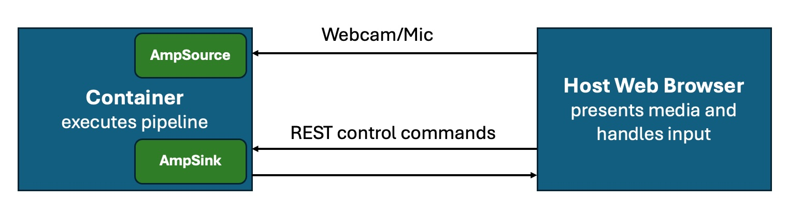

# Containerized Execution Model
## About

The system is designed around a container-first development and deployment model.

Developers pull the repository and build the development container.
This provides a consistent and reproducible working environment across platforms.

The container executes the GStreamer pipeline, including inference workloads.

---

## Development Model

- The repository defines the full build environment.
- The container encapsulates all dependencies.
- The same environment is used across Linux, macOS, Windows, Raspberry PI5 and other devices.
- This eliminates host-specific configuration drift.

While containers provide reproducibility, they introduce runtime challenges:

- The container is isolated from the host display server.
- Video/audio playback inside the container is non-trivial.
- Direct GPU / display integration may be constrained.
- UDP-based audio/video streaming is often laggy and unstable.
- Media debugging becomes difficult with traditional forwarding approaches.

---

## AmpSink: WebRTC-Based Output

To solve these issues, the system introduces **AmpSink**.

Our element is called AmpSink.
AmpSink provides a web endpoint inside the container publishing media.
The host web browser connects to this endpoint and renders the media stream.

- Streams media using WebRTC.
- Provides low-latency video and audio output.
- Avoids unstable UDP streaming.
- Works reliably across host platforms.
- Enables browser-based pipeline control.

---

## WebSocket Control Interface

The browser communicates with the container using WebSocket control commands.

This allows:

- Pipeline start/stop control
- Triggering actions
- Service management

Media transport and control signaling are cleanly separated.

---

## AmpSource (Planned)

AmpSource extends the architecture in the opposite direction.
The system routes the browser camera and microphone data into the container.
Also web based video/audio streams can be routed into the container as a source for a pipeline.
Media is streamed into the pipeline.
This enables different use cases where the user can use the device with a single browser connection.

Example use cases:

- Video conference with neural network inferences
- Realtime translated web radio

---

## Architectural Benefits

- Containerized reproducibility
- WebRTC-based stable media streaming
- No host display dependencies
- Clean separation of runtime and presentation layers
- Browser-based universal interface
- Edge-ready deployment model

This model allows development, testing, and deployment using the same architecture,
from local machines to Raspberry Pi 5 and other edge devices.