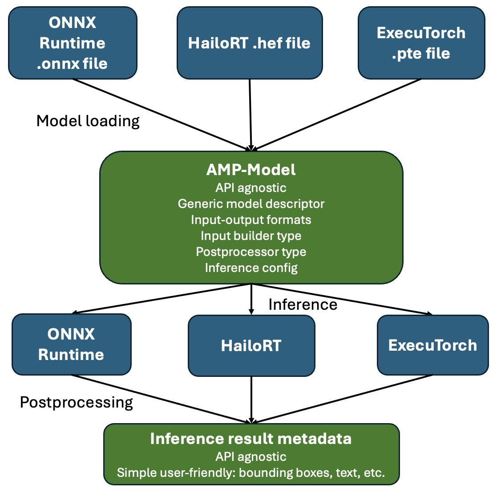

# Inference Execution Flow
## Engine-Specific Loading+Inference with Engine-Agnostic Processing

The AMP inference architecture deliberately separates:

- Engine-specific responsibilities  
- Engine-agnostic processing logic  

 We use even separated .so files for the different inference engines, so the different SDKs, 
 libraries, headers, dependencies can be handled fully separated from each other and the core system.



This ensures portability, modularity, and clean backend abstraction.

The lifecycle of a model and inference execution follows a structured
transition between engine-specific and engine-independent domains.

## Engine-Specific Model Load

The selected inference backend (e.g., ONNX, HailoRT, ExecuTorch):

- Loads the model file
- Parses model graph structure
- Extracts tensor names
- Extracts tensor shapes
- Extracts value types
- Extracts quantization parameters

## Conversion to Engine-Agnostic Model

After successful loading and validation, the backend constructs
an `amp::Model` instance.

`amp::Model` becomes the **platform-independent, canonical representation**
of the model within the AMP framework.
No backend-specific structures leak into generic code.
Tensor metadata is handled uniformly.

## Generic Preprocessing (Engine-Agnostic)

Before inference is invoked:

- Generic preprocessing Ops execute
- Input image resizing is performed
- Layout conversion is applied (e.g., HWC to CHW)
- Normalization is applied (mean/std)
- Quantization preprocessing is handled

All preprocessing logic operates with:

- `ModelInput` metadata
- `DataKind`
- `Shape`
- Quantization parameters

This stage is entirely engine-independent.

## Engine-Specific Inference Execution

Once tensors are prepared:

- The inference Op calls the backend runtime
- The engine performs forward execution
- Raw output tensors are produced

This is the only stage where the backend runtime is active (and model loading).

The engine writes results into raw tensor memory.
That will be read wrapped into a `TensorView` that does the dequantazition.

## Engine-Agnostic Postprocessing

After inference execution:

- Output tensors re-enter engine-agnostic territory
- `TensorView` abstracts raw memory
- Generic postprocessing logic executes
- Domain-specific parsing occurs (e.g., detection decoding, classification mapping)
- Results are written into Perception structures

No backend-specific logic is required at this stage.

## The overall flow can be summarization

```
Engine-specific load
  ↓
amp::Model (engine-agnostic representation)
  ↓
Generic preprocessing
  ↓
Engine-specific inference execution
  ↓
Generic postprocessing
```

This separation ensures:

- Backend pluggability
- Clean layering
- No runtime coupling between generic logic and engine internals
- Deterministic behavior across engines
- Easier testing and validation

---

## Key Design Principle

The inference engine is responsible only for:

- Loading the model
- Executing the forward pass

All other responsibilities are handled generically:

- Preprocessing
- Postprocessing
- Inference result formatting

This design guarantees that:

- Switching backends does not require rewriting preprocessing logic
- Postprocessing logic is reusable across engines
- OpChains remain stable regardless of the underlying inference runtime

