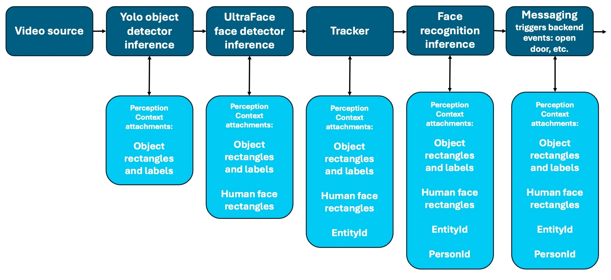

# Perception
## Inference Data Collection and Aggregation Model

Perception is the persistent data model that accumulates structured results
produced by inference elements within the GStreamer pipeline.

Each inference stage reads from and writes to the same Perception instance,
which travels alongside the media buffer.

---

## Core Principles

- Inference elements attach structured metadata to Perception.
- Perception is propagated with the GStreamer buffer.
- Each stage may enrich, refine, or augment previously attached data.
- Data remains accessible to downstream elements.

---

## Incremental Enrichment

The pipeline may contain multiple inference stages, such as:

- Object detection
- Face detection
- Tracking
- Face recognition
- Event or messaging triggers

Each stage contributes additional metadata:

- Object rectangles and labels
- Human face rectangles
- Entity identifiers
- Person identifiers
- Domain-specific attributes

Perception evolves step-by-step as the buffer moves through the pipeline.

---

## Branching Pipelines

The GStreamer pipeline may contain branches.

- Audio and video inference chains may run in parallel.
- Multiple model families may process the same frame.
- Independent branches can attach metadata simultaneously.

Results from different branches are merged into the same Perception model.

---

## Parallel Inference

The architecture supports:

- Video inference
- Audio inference
- Multi-model execution
- Multi-stage refinement

Parallel processing does not duplicate state.
All inference results are aggregated into a single Perception instance.

---

## Complex Use Cases

This incremental and composable design enables:

- Multi-stage detection → tracking → recognition pipelines
- Cross-modal fusion (audio + video)
- Hierarchical inference flows
- Backend-triggered messaging and event systems

Perception acts as the structured, persistent knowledge graph of the current
media buffer.

It is the central integration point between inference, tracking, and
application-level logic.