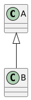

# TensorParser
## Output Tensor Interpretation Interface

TensorParser defines the interface responsible for converting raw inference
output tensors into structured perception metadata.

The parser operates on tensor memory produced by an inference runtime and
translates the raw numerical outputs into domain-specific information that
can be stored in the Perception model.

TensorParser implementations are backend-agnostic and focus solely on
interpreting model outputs.

---

# Purpose

Inference runtimes produce raw tensor data.
TensorParser implementations interpret this data and generate structured
metadata suitable for downstream processing.

Typical responsibilities include:

- Interpreting tensor layouts
- Decoding detection outputs
- Extracting classification results
- Converting model-specific formats into framework-standard metadata
- Writing results into a Perception layer

---

# Input Structure

`TensorParser::Input`

The Input structure aggregates all contextual information required for
parsing inference outputs.

It provides:

- Access to output tensor memory blocks
- Inference metadata describing execution context
- Attribute configuration for parser customization
- The target Perception layer context (Perception::Layer instance)

The parser does not own tensor memory and must treat all tensor pointers
as externally managed.

---

# Execution Contract

`parse(const Input&, Perception::Layer&)`

The parse method:

- Reads tensor memory from the provided Input.
- Interprets the model outputs according to implementation logic.
- Writes structured results into the provided Perception layer.
- Returns a Result indicating success or failure.

The parser must not modify tensor memory.
The parser is responsible only for interpretation and metadata generation.

---

# Architectural Role

TensorParser forms the boundary between:

- Low-level inference tensor memory
- High-level perception metadata representation

This separation ensures:

- Clear responsibility boundaries
- Reusable inference backends
- Model-specific parsing isolation
- Clean extensibility for new model types

New models can be integrated by implementing a corresponding TensorParser
without modifying the core execution engine.

The default parsers are located in **amp-std-ops**.

---

# Implemented Tensor Parsers

The following TensorParser implementations are currently available.
Each parser converts model-specific output tensors into structured
Perception metadata.

---

## YOLO Parser

Parses object detection outputs produced by YOLO-based models.
Extracts bounding boxes, class identifiers, and confidence scores.
Writes detected objects into the Perception layer.

We also have a parser for the HailoRT accelerated Yolo output, when the network handles the NMS differently.

## UltraFace Parser

Parses face detection outputs from UltraFace models.
Extracts face bounding boxes and associated confidence values.
Optimized for lightweight and real-time face detection scenarios.

## Gaze Detector Parser

Parses the output of the gaze estimation model by Arm.
Interprets directional vector yaw/pitch values as gaze angles.
Attaches gaze-related metadata to the Perception layer.

## Paddle OCR Detector Parser

Parses text detection outputs from Paddle OCR detection models.
Extracts text regions segmentation map.
Stores detected text regions for downstream recognition stages.

## ImageNet Classification Parser

Parses classification outputs from ImageNet-style models.
Extracts top-k class predictions and confidence scores.
Attaches classification results to the Perception layer.

## Person Classification Parser

Parser for the person classification network of the Arm AAIR team.
Stores person classification detection object in the layer.

# Additional Parsers

Additional parsers can be implemented by conforming to the TensorParser
interface without modifying the core execution engine.

The system provides a mechanism for implementing custom output parsers with minimal effort.

Parser logic can be written in Python.
The framework supplies direct access to the output tensor data along with a structured interface for populating the resulting detection layer.

This enables rapid experimentation and iteration, particularly for machine learning engineers who need to validate new models or adjust postprocessing logic without modifying the core C++ runtime.

