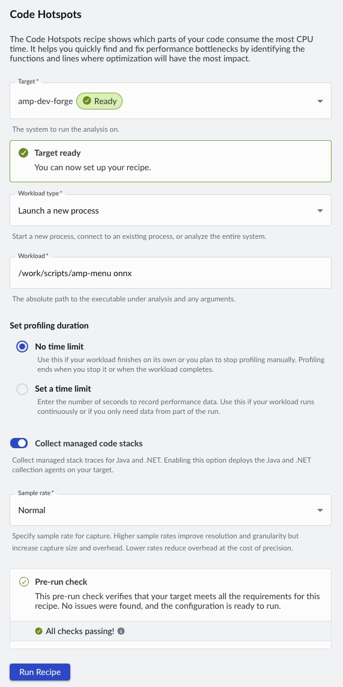
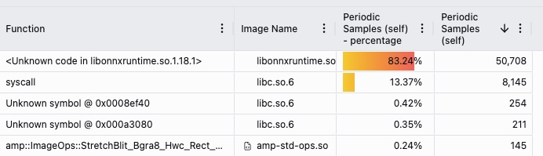

# Performix Quick Guide

Performix is a standalone with which we can monitor performance metrics of our device.

Download Peformix here:
https://developer.arm.com/servers-and-cloud-computing/arm-performix

---

## SSH

Both tools require the target to be reachable via an SSH connection. The container uses port `2222` to accept SSH connections.

Both tools work if the host and the target share an RSA key pair.

---

## Generate SSH Keys

You need to generate two files — these are the SSH keys for the connection. If your target is already reachable via SSH, you can skip this step.

```bash
ssh-keygen -m PEM -t rsa -b 4096 -f ~/.ssh/performance_key_rsa -C "performance-container-key"
```

This creates:

- ~/.ssh/performance_key_rsa (private key)
- ~/.ssh/performance_key_rsa.pub (public key)

---

## Set Permissions

```bash
chmod 600 ~/.ssh/performance_key_rsa  
chmod 700 ~/.ssh
```

---

## Install Public Key on Target

On the target (or dev container):

```bash
cat ~/.ssh/performance_key_rsa.pub >> ~/.ssh/authorized_keys  
chmod 600 ~/.ssh/authorized_keys
```

---

## Test SSH Connection

Test the SSH connection from the host:

```bash
ssh -i ~/.ssh/performance_key_rsa devgoblin@127.0.0.1 -p 2222
```

It should let you in without a password. Use different IP for remote target devices.

---

## Troubleshooting

If SSH does not work:

- Check permissions on target:  
  chmod 700 ~/.ssh  
  chmod 600 ~/.ssh/authorized_keys  

- Verify SSH server is running in the container

- Ensure port 2222 is exposed and mapped correctly

---

## gatrod

The application 'gatord' is a tool that helps collecting information on the target and send it to the host-side tools.
The arm64 and x86_64 versions are included in the repo /work/etc/gatord folder.

Install hints: 

```bash
sudo install -m 755 /work/etc/gatord/ /usr/local/bin/gatord
which gatord
gatord --help | head
```

The target must support Linux performance monitoring features:

- perf_event enabled in kernel (CONFIG_PERF_EVENTS)
- /proc and /sys mounted
- Appropriate permissions (root or perf_event_paranoid = -1)

Without these, data collection may fail or be incomplete.

---

## Performix SSH

In Performix the SSH setup is very similar.


After clicking 'Add Target' you have to populate the form with information:
- Host: 127.0.0.1 or the IP address of the target device
- Name: An arbitrary name for the target
- Port: SSH port (2222)
- User: User name on target (devgoblin)
- Key sleection: 'Select key manually' works with the above generated key

You can 'Test Connection' also here.

## Performix Recipes

To do some measurement in Performix you need a recepe. 
Not all kinds of measurements are possible in a container.

Now here is an example of setting up one that works:
- Target: Name of the target
- Workload type: Launch a new process
- Workload: The process that will be executed and measured on the target (/work/scripts/amp-menu onnx)
- Set profiling duration: Limitless or execution for a limited time only
- Different other settings

The 'Run Recipe' button executes the target applicaion and do the measurement.



After running a recibe by clicking on 'Run Recipe' you will get the measurement results.


