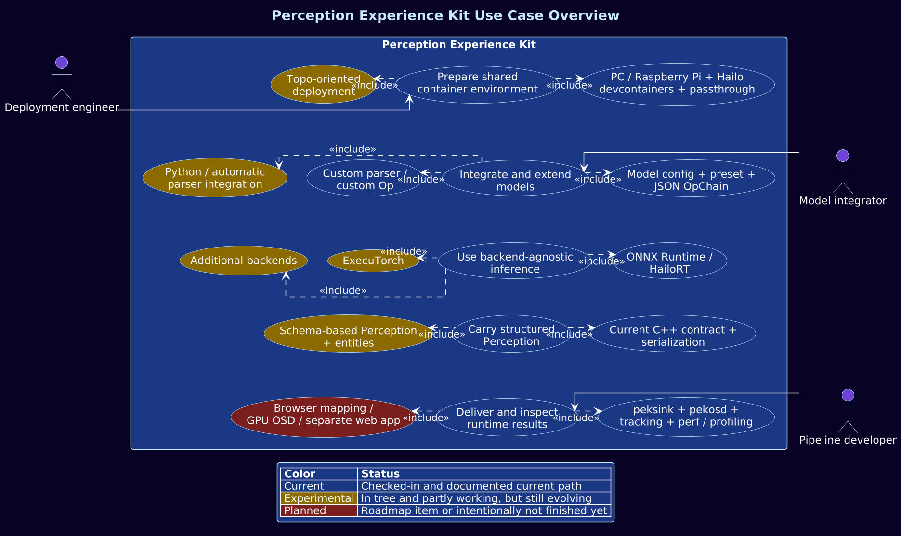

# Architectural Overview
## Perception Experience Kit execution model and GStreamer integration

Perception Experience Kit is a GStreamer-centric inference execution framework, designed to run AI workloads in media pipelines.
GStreamer provides the media transport and scheduling, while the core execution model is independent and can run without GStreamer.
In this architecture, GStreamer primarily feeds audio/video buffers into the system and carries results downstream as metadata.

---

## System Composition

The system is implemented as a set of reusable GStreamer elements that can be inserted into existing pipelines.

Core elements:

- `pekinfer`  
  Runs micropipelines (OpChain) that perform preprocessing, inference, and postprocessing.
  Produces structured results into Perception.
  OpChains can contain other processing steps, but inference is the most important one in this project.

- `peksink`  
  Provides WebRTC-based output to a browser for stable, low-latency A/V visualization from containerized pipelines.

- `pekosd`  
  Visualizes results by decorating video frames using Perception metadata.
  Planned extension: DMABUF-based Vulkan rendering for zero-copy pipelines.

- `pektracker`  
  Tracks detections across frames and stabilizes identities and trajectories over time.

- `pekperformance`  
  Collects and exposes performance metrics to support profiling and runtime analysis.

Each element can be placed into any existing GStreamer pipeline as a modular building block.

---

## Use Case View

The following use-case view complements the element-oriented description below.
The diagram aims to be a higher level view of our functionalities focusing on user-facing capabilities and default extension surfaces.
Amber for experimental or still-evolving areas such as ExecuTorch and audio inference, and red for planned or intentionally unfinished directions such as Python-based post processing.

---

## Component View

This component view focuses on the runtime shape inside the container boundaries.
It intentionally treats `GStreamer` as the current pipeline host layer rather than as the long-term architectural center of the system.
The stable interfaces worth carrying across component boundaries are the Perception Experience Kit element model, `OpChain` inside `pekinfer`, and above all `Perception` as the runtime contract.
`pekinfer` creates and enriches `Perception` through OpChain execution, `pektracker` and `pekperformance` append more structured data, `pekosd` consumes it for visualization, and any external application-facing boundary can treat serialized `Perception` as the main contract.

---

## General activity diagram

This activity diagram is intentionally more implementation-oriented than the use-case and component views.
It traces the path from `pek-menu` preset parsing through element initialization and then into the steady-state per-buffer execution path inside `pekinfer`, `pektracker`, `pekperformance`, `pekosd`, and `peksink`.

---

## Op System and micropipelines

The internal processing model is based on an Op system.

- An `Op` is a modular processing unit with a strict lifecycle (`configure`, `bind`, `process`).
- Ops are composed into ordered pipelines called `OpChain`.
- OpChains define “micropipelines” that implement a specific processing goal
  (e.g., face detection, gaze estimation, OCR detection, classification).

OpChains are created from JSON descriptors and can be executed inside `pekinfer`
or as standalone pipelines without GStreamer.

This enables pipeline composition and model swapping without recompilation.
The micropipelines are flexible enough to define non-inference tasks.
Different inference engines can be used even within a single micropipeline.

---

## Configuration Model

All runtime setup is currently defined in JSON.

JSON configuration is used to describe:

- Which elements build up the micropipeline (OpChain)
- Op attributes (models, thresholds, parsers, preprocessing settings)
- Backend selection also configured via Ops
- Model cascading

---

## Perception Data Model

Perception is the persistent inference result container.

- It travels downstream alongside the media buffer.
- It aggregates structured results across pipeline stages.
- Each inference or postprocessing stage can append new Perception Layers.

A Perception Layer captures one inference step and its outputs.
This enables complex pipelines such as:

- multi-model cascades (detection → refinement → classification)
- parallel branches (audio + video inference)
- incremental enrichment across elements

- [Perception](perception.md)  
  See details here.

---

## Tracking

`pektracker` uses Perception detections and derives cross-frame information from them.
In the ideal case, it creates an **entity** that represents a real-world object.
In that case, a missing detection on a single frame does not mean that the entity is lost.

Goals:

- Improve temporal stability of detections.
- Preserve identities across time.
- Attach track identifiers and trajectories back into Perception.

Today, it updates tracked detections in-place and can emit `TrackTrace` layers.
Richer tracker-specific output layers are still evolving.

---

## Visualization and Rendering

`pekosd` uses Perception to render visual overlays on video frames.

Current behavior:

- Decorates frames with inference results (rectangles, labels, etc.).

Planned behavior:

- DMABUF-based Vulkan rendering to support zero-copy pipelines.
- Reduced latency and CPU overhead for high-performance edge deployments.

---

## End-to-End Data Flow

A typical execution flow:

1. GStreamer delivers an audio/video buffer into the pipeline.
2. `pekinfer` executes an OpChain for preprocessing → inference → postprocessing.
3. Results are written into Perception as one or more Layers.
4. `pektracker` optionally stabilizes detections across frames and can append `trackTrace` output.
5. `pekosd` optionally visualizes Perception results on video frames.
6. `peksink` optionally streams the output to a browser via WebRTC.
7. `pekperformance` records runtime performance information.

This modular architecture enables flexible composition while keeping the core inference engine reusable outside GStreamer.
