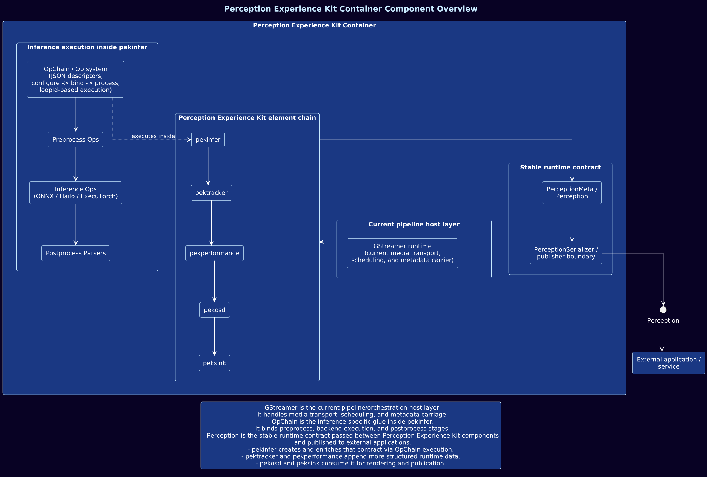
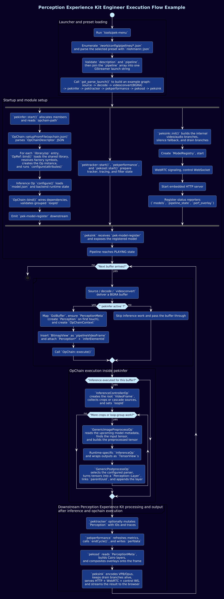

# Architectural Overview

Perception Experience Kit uses GStreamer as the media pipeline host while keeping
its inference execution model organized around reusable OpChains and structured
`Perception` metadata. GStreamer delivers media buffers and schedules elements;
PEK elements process those buffers, enrich metadata, and expose results for
rendering, streaming, or application use.

## Component View

The runtime is built around `Perception` as the shared data contract. `pekinfer`
creates and enriches it through OpChain execution, `pektracker` and
`pekperformance` can append runtime data, `pekosd` consumes it for overlays, and
application-facing boundaries can serialize it for external consumers.

## Activity View

The activity view traces the path from `pek-menu` preset parsing through element
initialization and into the steady-state per-buffer execution path.

## Execution Model

The internal processing model is based on Ops and OpChains. An `Op` is a
processing unit with a defined lifecycle, and an `OpChain` is an ordered set of
Ops used for preprocessing, inference, postprocessing, or other local processing
steps. OpChains are configured from JSON and can run inside `pekinfer` or outside
GStreamer. See [Op system](op-system.md) and [OpChain Context](op-chain-context.md).

Runtime configuration describes the selected OpChain, Op attributes, model and
backend choices, thresholds, parser settings, and cascade behavior. This keeps
pipeline composition and model swapping in configuration instead of requiring a
rebuild for common changes.

## Perception Data Model

`Perception` is the persistent runtime result container. It travels downstream
with the media buffer and aggregates structured layers produced by inference,
postprocessing, tracking, and performance elements. This supports cascades,
parallel branches, and incremental enrichment across the pipeline. See
[Perception](perception.md).

## End-to-End Flow

A typical execution flow:

1. GStreamer delivers an audio or video buffer into the pipeline.
2. `pekinfer` executes an OpChain for preprocessing, inference, and postprocessing.
3. Results are written into `Perception` as one or more layers.
4. `pektracker` can stabilize detections across frames and append tracking output.
5. `pekperformance` records runtime performance information.
6. `pekosd` can draw `Perception` results onto video frames.
7. `peksink` can stream the output to a browser through WebRTC.

This keeps the pipeline modular while allowing the core inference execution model
to remain reusable outside GStreamer.
