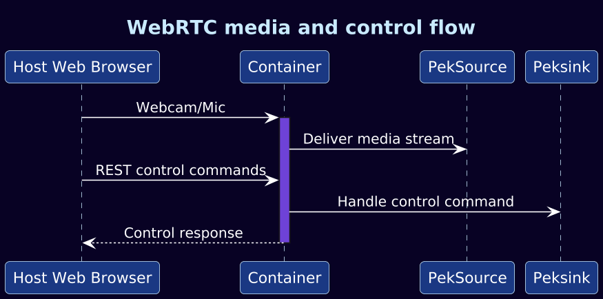

# peksink

`peksink` is a `GstBin` that packages media encoding, WebRTC delivery, HTTP
serving, and control channels into one GStreamer element. It is primarily used to
make containerized or headless pipelines visible and controllable from a browser.

## Element Contract

- Base class: `GstBin`
- Video sink pad: `videosink`, always present
- Audio sink pad: `audiosink`, request pad
- Output: WebRTC transport rather than a normal downstream pad
- Video encoding: VP8
- Audio encoding: Opus, with silence fallback when no real audio is connected

The element internally builds and owns the media sub-pipeline needed for browser
streaming.

## Media Paths

The video path converts raw video, queues it, encodes VP8, synchronizes timing,
and feeds a tee. One branch goes to WebRTC; another drain branch prevents stalls
when no browser client is connected.

The audio path always has a silence source available. If the `audiosink` request
pad is used, an input selector switches from silence to real audio. A drain branch
serves the same non-blocking role as the video path.

## WebRTC, HTTP, And Control

`peksink` embeds several non-GStreamer services:

- a WebRTC WebSocket server for signaling
- a control WebSocket for runtime commands and status reporters
- an HTTP server for static browser content
- a model registry exposed through the control channel

`pekinfer` emits `pek-model-register` events, and `peksink` records that model
state for browser-side visibility. It also handles unregister events if an
upstream component emits them.

## Lifecycle

Initialization constructs the media chains, starts WebRTC/control/HTTP services,
and registers status reporters. Disposal stops the services, releases request
pads, clears selector references, and frees private state.

Teardown order is important because request pads, selector active pads, and server
threads can otherwise retain references longer than expected.

## Properties

- `host`: HTTP server bind address
- `http-port`: HTTP server port
- `ws-port`: WebRTC signaling port
- `ctrl-port`: control WebSocket port
- `static-files`: static content directory

## Architectural Caveat

`peksink` currently combines media delivery, UI hosting, control, model registry,
and runtime status in one element. This is convenient for demos and development,
but it is not the desired long-term application boundary. See
[Known Limitations](../known-limitations.md).
