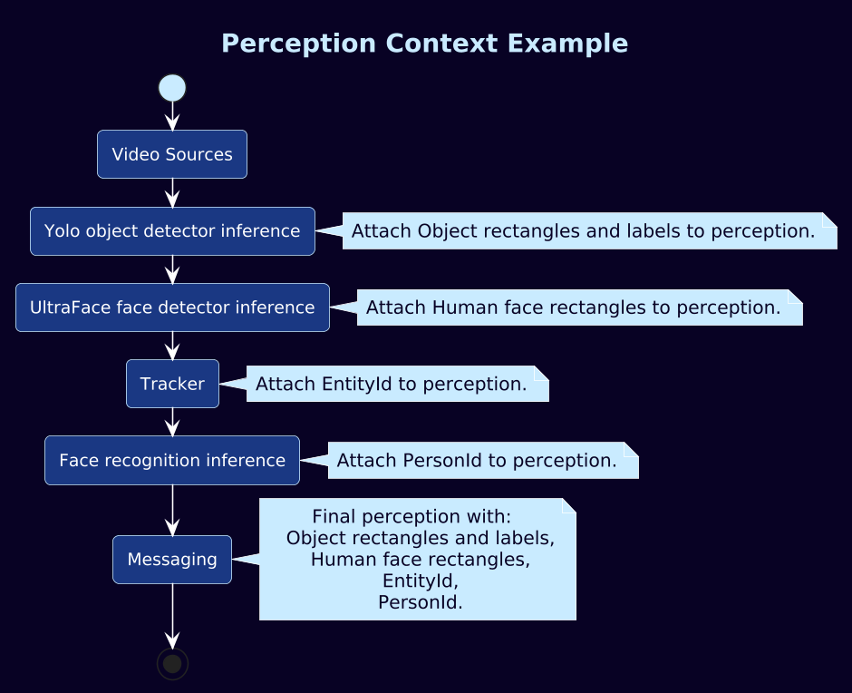

# Perception
## Persistent Inference Result Model

Perception is the persistent metadata container that travels downstream with the media buffer.
It aggregates structured results produced by inference and postprocessing stages across the pipeline.

Perception is designed to support:
- Multi-stage inference (detection → refinement → classification).
- Branching pipelines (parallel video/audio inference).
- Stable cross-stage references via UUID relationships.
- Backend-agnostic metadata representation.

---

## Core Data Model

### Object

`Perception::Object`

Common base for all stored entities.

- `uuid` uniquely identifies the entity instance.
- `parentUuid` links an entity to its logical parent (e.g. detections to the frame, or derived detections to a source ROI).
- `creationTsNs` captures creation time for correlation and ordering.

This enables stable linking between pipeline stages without relying on positional indices.

---

## Frame Anchors

### VideoFrame

`Perception::VideoFrame`

Descriptor for a video frame and its geometric transforms. Derived from Object.
Acts as the parent/root for vision inference detections originating from that frame.

Stores original dimensions and crop/letterbox parameters, enabling coordinate normalization and reverse mapping.

### AudioFrame

`Perception::AudioFrame`

Descriptor for an audio chunk. Derived from Object.
Acts as the parent/root for audio inference detections.

Stores original stream properties and cut parameters to preserve alignment and traceability.

---

## Detection Primitives

Perception provides a small set of normalized detection types that cover common inference outputs:

- `Rect` for localized detections with confidence and optional class/text annotation.
- `Classification` for top-k candidates (optionally with region hints).
- `YawPitch` for angular/regression outputs (e.g. gaze/head pose).
- `LocalizedText` for OCR-like localized text payloads.
- `SegmentationMap` for dense pixel-level outputs.
- `TrackTrace` for tracker history rendered as a motion trail.
- `ObjectEmbedding` for embedding or ReID vectors linked to a parent detection.

All detection types inherit from Object and can participate in parent/child relationships.

---

## Detection Variant

`using Detection = std::variant<...>`

Detections are stored as a tagged variant.
This keeps the container type-safe while allowing heterogeneous outputs per layer.

---

## Layer

`Perception::Layer`

A Layer represents the results of a single inference step.

Layer metadata provides provenance and interpretation context:

- `engine` identifies the runtime backend (e.g. ONNX RT, Hailo RT, ExecuTorch).
- `model` identifies the model used.
- `tags` provide implementation-specific routing/labeling hints.
- `inferElementId` identifies the `pekinfer` or tracker instance that produced the layer.
- `labelFamily` describes the label set namespace (e.g. coco, imageNet).
- `contentType` describes the semantic output category (e.g. humanFace, classification, eyeYawPitch).

`detections` contains the structured outputs produced by that inference step.

---

## Performance Data

`perfdata` stores performance-related strings for tracing and profiling.
This enables lightweight instrumentation propagation alongside inference results.

---

# Why This Architecture Works Well

- Provenance is explicit: each Layer captures engine/model context, enabling reproducible interpretation and debugging.
- Cross-stage linking is robust: UUID + parentUuid enables stable relationships across pipeline branches and multi-stage inference.
- Backend-agnostic representation: inference runtimes can be swapped while producing consistent Perception outputs.
- Scales to complex pipelines: multiple Layers accumulate naturally (parallel branches, multi-model cascades, refinement chains).
- Type-safe heterogeneity: variants allow multiple detection types without fragile base-class hierarchies or untyped maps.
