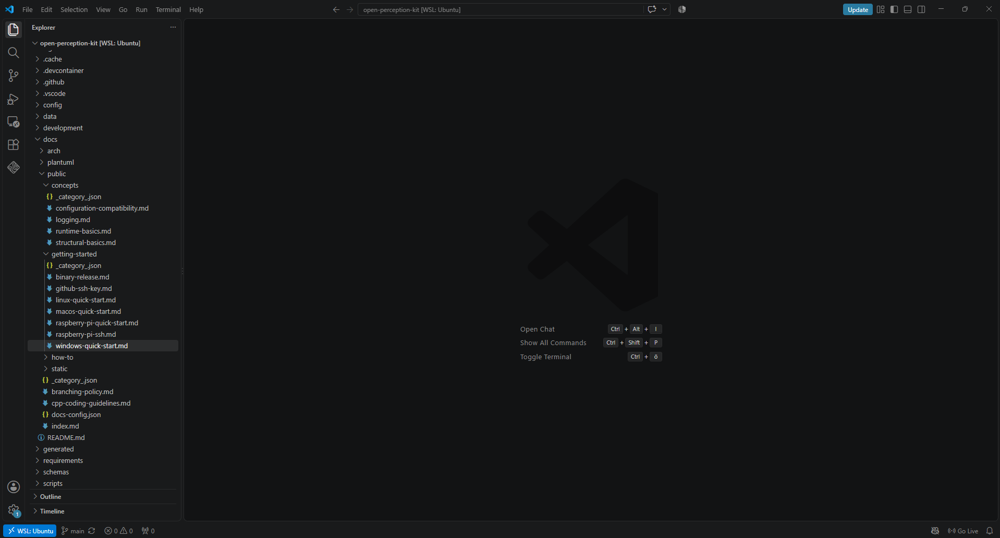
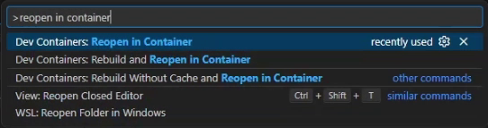
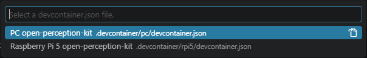
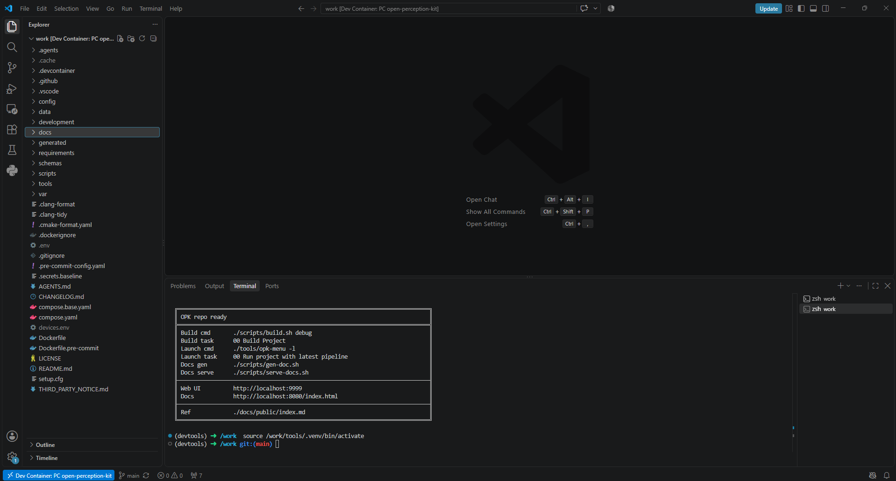
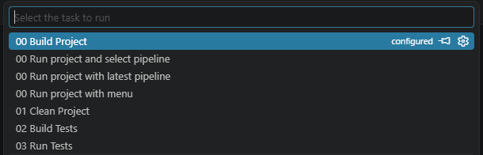
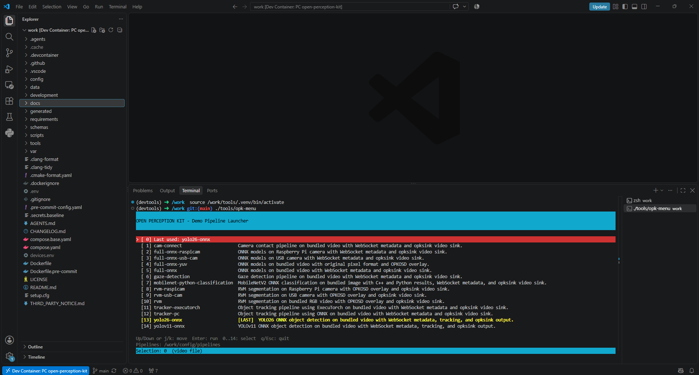
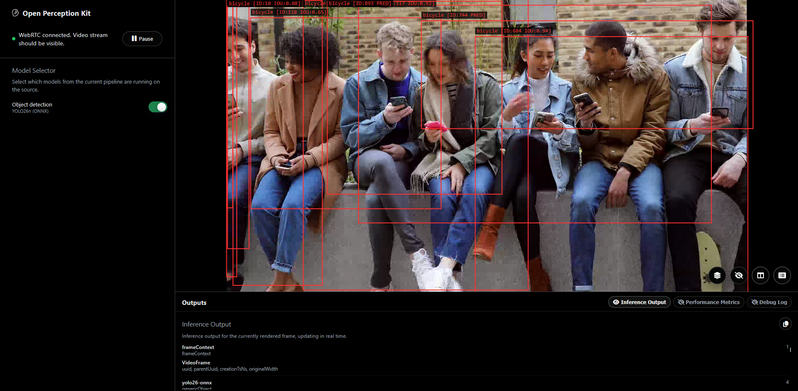

# macOS Quick Start

Use this guide on a Mac. OPK runs inside a VS Code Dev Container. The first run uses checked-in sample media and the local browser UI.

## What You Need

Install these before you start:

- Git.
- Docker Desktop.
- Visual Studio Code.
- VS Code **Dev Containers** extension.

Docker Desktop is the recommended path for this quick start.

## 1. Check The Tools

Run in the **host shell**:

```bash
git --version
docker --version
docker compose version
code --version
```

If Docker commands fail, open Docker Desktop and wait until it says Docker is running.

## 2. Get The Repository

The easiest path is HTTPS cloning. It does not require an SSH key.

Run in the **host shell**:

```bash
git clone https://github.com/arm/open-perception-kit.git
cd open-perception-kit
```

If you must clone with SSH, set up your key first: [GitHub SSH Key Setup](github-ssh-key.md).

Expected result: you are in the `opk` folder.

## 3. Open The Project In VS Code

Run in the **host shell**, from the `opk` folder:

```bash
code .
```

The standard OPK models download without a Hugging Face account or token.
For your own private or gated models, see
[Bring your model](../how-to/bring-your-model.md).

In VS Code:



1. Open the Command Palette with `Cmd+Shift+P`.
2. Run **Dev Containers: Reopen in Container**.



3. Choose **PC open-perception-kit**.



4. Wait for the container to finish building.

Expected result: VS Code reloads into the Dev Container.



## 4. Build OPK

Open a new terminal in VS Code after the container is ready. This terminal is the **Docker shell**.

Run in the **Docker shell**:

```bash
./scripts/build.sh debug false
```

You can also use the VS Code task **00 Build Project**.



Expected result: the build finishes without errors and `tools/opk-menu` exists.

## 5. Start The First Pipeline

Run in the **Docker shell**:

```bash
./tools/opk-menu yolo26n-320
```

You can also use the VS Code task **00 Run project and select pipeline** and choose `yolo26n-320`.



Expected result: the pipeline starts and keeps running in the terminal. Leave that terminal open.

## 6. Open The Web UI

Open Safari, Microsoft Edge, or Firefox:

```text
http://localhost:9999
```

In the **Model Selector** panel, enable a model to start inference.



Expected result: the page shows the OPK view and enabling a model produces an overlay or result. The default quick-start pipeline uses checked-in sample media, not a live camera.

## 7. Stop And Run Again

To stop OPK, click the terminal that is running the pipeline and press `Control+C`.

To run the last selected pipeline again, run in the **Docker shell**:

```bash
./tools/opk-menu -l
```

## If Something Fails

- If the container cannot start, check that Docker Desktop is running.
- If the browser cannot connect, confirm the pipeline is still running in the Docker shell.
- If the browser opens but no result appears, enable a model in the **Model Selector** panel.
- If you connect from this Mac to a Raspberry Pi later, allow VS Code local network access in macOS **Settings > Privacy & Security > Local Network**.

[Back to Get Started](/getting-started)
