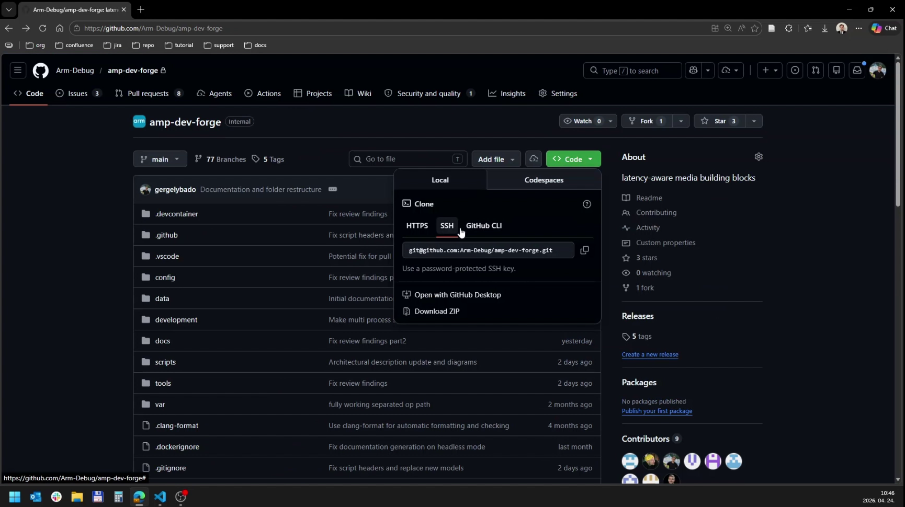
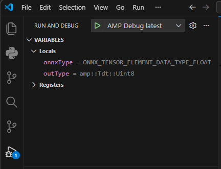

# Deep dive

This is the deep-dive setup and usage guide.

If you only want the shortest path to a first run, use the platform quick guide pages instead.
If you want the fuller setup path and the next documentation hub after this tutorial, continue from here to [Engineering starting point](engineering.md).

## Terminology

* host - windows+WSL/Linux/mac PC
* host side container - containerized environment on the windows+WSL/Linux/mac PC host
* remote host - Raspberry Pi is the only supported remote host as of now.
* remote host container - containerized environment on the RPi host
* target - Only applicable during deployment when from a host (windows+WSL/Linux/mac PC) we deploy the container onto the target(Raspberry Pi at the moment)

## What will you learn from this documentation?

If you follow this guide successfully, you will learn how to:

- prepare a supported host or remote host for Perception Experience Kit
- clone the repository and open it in the expected container workflow
- build the project, use the VS Code tasks or `pek-menu`, and start a first pipeline
- find the published endpoints and continue into the next engineering-focused documents

At the end of this guide, you should have a working Perception Experience Kit environment on your desk, a first pipeline running, and a clear path to the next deep-dive topics.

## Quick Overview
- **Goal:** Get Perception Experience Kit running on a host or remote host
- **You'll need:** Docker, VS Code, Git, and an SSH key
- **Recommended first run:** ONNX pipeline

**Steps:**
1. [Clone the Perception Experience Kit repository](#clone-the-repository)
2. [Install dependencies](#prerequisites)
3. [Open and build the project](#open-and-start-the-project) or [deploy with Topo](topo.md)

---

### Clone the repository
For PC development, clone the repository on your host.
For on-device Raspberry Pi 5 development, clone the repository on the remote host after setting up SSH successfully.
Alternatively you can develop on your host and deploy to the target with Topo.


If you need a source archive instead of a Git clone, use the release page and download the compressed source package.


Replace `<version>` with the release tag you want to use, for example `v0.1.0`.

Download and extract the ZIP archive:

```bash
# If unzip is missing on a Debian-based system:
sudo apt-get install -y unzip

unzip amp-dev-forge-${VERSION}.zip
mv amp-dev-forge-${VERSION} amp-dev-forge
cd amp-dev-forge
```

If you use the archive path, continue from the next step after `cd amp-dev-forge`.

To clone with Git instead, use:

```bash
git clone git@github.com:Arm-Debug/amp-dev-forge.git
cd amp-dev-forge
```


## Prerequisites

We currently support four hosts: Windows with WSL, Linux, macOS, and Raspberry Pi 5.
Install the required tools on your host in order to use the project.

Although not complete, a check script can help the user determine whether the prerequisites are met: "./scripts/pre-req.sh"

> Besides the listed dependencies, additional tools are installed inside the development or deployment container.
Working directly on the host outside the container is not well supported at the moment. The project assumes container-managed dependencies.

### Windows with WSL
   * [WSL](https://learn.microsoft.com/en-us/windows/wsl/install)
   * [Git](https://git-scm.com/install/)
   * [Docker Desktop](https://www.docker.com/products/docker-desktop/)
   * [Visual Studio Code](https://code.visualstudio.com/download)
   * [VS Code Dev Containers extension](https://marketplace.visualstudio.com/items?itemName=ms-vscode-remote.remote-containers)
   * [WSL USB Manager 5.7.0](https://github.com/nickbeth/wsl-usb-manager)

### Linux
   * [Git](https://git-scm.com/install/)
   * **Docker**
      * For docker installation on ubuntu or debian follow the specific steps defined by Docker
      * [Ubuntu Installation Guide](https://docs.docker.com/engine/install/ubuntu/)
      * [Debian Installation Guide](https://docs.docker.com/engine/install/debian/)
   * [Visual Studio Code](https://code.visualstudio.com/download)
   * [VS Code Dev Containers extension](https://marketplace.visualstudio.com/items?itemName=ms-vscode-remote.remote-containers)
   * **v4l-utils**

The following command should help with this.

```bash
sudo apt-get update
sudo apt-get install -y git code v4l-utils
```

### macOS
   * [Git](https://git-scm.com/install/)
   * [Docker Desktop](https://www.docker.com/products/docker-desktop/)
      * Colima is not tested at the moment due to networking issues.
   * [Visual Studio Code](https://code.visualstudio.com/download)
   * [VS Code Dev Containers extension](https://marketplace.visualstudio.com/items?itemName=ms-vscode-remote.remote-containers)
   * [VS Code Remote SSH extension](https://code.visualstudio.com/docs/remote/ssh), if you connect to a Raspberry Pi
      * Grant VS Code local network access in **Settings -> Privacy & Security -> Local Network**, otherwise the remote connection may fail.

### Raspberry Pi 5
   * **VS Code Remote SSH extension on the host**
   * **VS Code Dev Containers extension on the host**
   * **Docker**
   * **Camera packages**
   * **Hailo 8 or Hailo 10 host stack**, depending on the accelerator path
   * **v4l-utils**
   * **Follow the specific [Required device and required packages on the remote host](rpi5.md) description to set up the raspberry pi host **
   * [Setup SSH connection](#ssh-setup)

Use `RPI5 H8 perception-experience-kit` for the Hailo 8 AI HAT path.
Use `RPI5 H10 perception-experience-kit` for the supported Hailo 10 accelerator path.
The Hailo 10 remote host container expects the Hailo 10 driver stack to already be installed on the remote host.
The primary supported Hailo AI HAT path is Hailo 8. Older Hailo 8L hardware may also work, but Hailo 8 and Hailo 8L compiled model files are not interchangeable.

### SSH setup
Before starting the host side container or remote host container, ensure that the `ssh-agent` is running and that your GitHub private key has been added to it.
This can be done in several ways depending on your operating system. The setup for Linux and macOS is as follows:

```bash
# For bash users: add ssh-agent to your .profile
eval "$(ssh-agent -s)"
```

The above command starts the SSH agent, which automatically adds your default keys (for example, `.ssh/id_rsa`, `.ssh/id_dsa`, etc.) from the `.ssh` directory.

If you need to add a different key, use the following command:

```bash
ssh-add [private_key_filename]
```

For further information and a detailed tutorial check out the following tutorial: [Generating a new SSH key and adding it to the ssh-agent](https://docs.github.com/en/authentication/connecting-to-github-with-ssh/generating-a-new-ssh-key-and-adding-it-to-the-ssh-agent)

For Raspberry Pi access, enable SSH during imaging when possible. During first setup, keep password authentication enabled in `/etc/ssh/sshd_config`:

```ini
PasswordAuthentication yes
```

If SSH or `raspberrypi.local` is unreliable, see [Troubleshooting](troubleshooting.md#raspberry-pi-ssh-and-mdns).

---

## Open and start the project
The project is meant to run inside a container: either a host side container on your host, a remote host container on your remote host, or a deployment container with Topo.

### Open Perception Experience Kit with VS Code
Open the cloned repository folder in VS Code first. Use **File -> Open Folder...**, or run `code .` from the repository root if the `code` command is available in your shell path.


* Open command palette:
  - Windows/Linux: Ctrl+Shift+P
  - macOS: Cmd+Shift+P
* Then select `Dev Containers: Reopen in Container`. A popup will appear.
   - For PC development choose "PC perception-experience-kit"
   - For Raspberry Pi on-device Hailo 8 development choose `RPI5 H8 perception-experience-kit`
   - For Raspberry Pi on-device Hailo 10 development choose `RPI5 H10 perception-experience-kit`
* After a successful container build, every dependency, pre-commit hook, and device should be ready to use inside the selected container.


Open a new terminal inside VS Code after the container is ready. The prompt should show that you are working inside the container workspace.


On the remote host, `.devcontainer/platform_init.sh` runs before container creation and generates the camera, audio, NPU, and shared-memory passthrough overrides for the selected service.

### Known Container issues
* If a required port is already reserved, the development or deployment container will not start.
* It is possible to use Docker only with Windows and WSL. In this case, Docker Desktop is not mandatory and host networking can also be used.

### Build Perception Experience Kit
- Open the Command Palette and run `Tasks: Run Task`, or use **Terminal -> Run Task...**
- **00 Build Project**: Builds all elements (default).
- **01 Clean Project**: Cleans build artifacts.
- **02 Build Tests**: Builds with tests enabled.
- **03 Run Tests**: Runs all tests.


### Start Perception Experience Kit

After a successful build, `pek-menu` will be created in the `tools` folder. This tool serves as the project entry point and simplifies GStreamer pipeline creation.

Prefer the VS Code tasks for routine launches:

- **00 Run project with menu**: opens the interactive `pek-menu` pipeline list.
- **00 Run project and select pipeline**: prompts for a pipeline and runs it directly.
- **00 Run project with latest pipeline**: reruns the last selected pipeline.

Alternatively, run the menu in a new terminal inside the active host side container or remote host container from the project root:

```bash
./tools/pek-menu
```
- Select a specific pipeline from the menu. Pipelines are defined under `config/pipelines`.
- To re-run the last-selected pipeline without the menu prompt:
```bash
./tools/pek-menu -l
```
At the moment, pipeline execution is fully synchronous end to end. An asynchronous inference execution flow is planned for a later update, but it is not available yet.

To stop an application that was not started from a VS Code launch configuration, press Ctrl+C in the console.

**First-time users:**  
- We recommend running **01-full-onnx** first.
It includes the main integrated ONNX pipelines and models currently available in the system.
- For a live camera first run, use **05-full-onnx-raspicam** on Raspberry Pi CSI camera setups or **06-full-onnx-usb-cam** for a USB camera exposed as `/dev/video0`.
- The shipped demo presets usually register their `pekinfer` elements with `active=false`.
  After the UI opens, use the **AI Models** panel to enable the models you want to run.


To stop a pipeline:
- Windows/Linux: Ctrl + C  
- macOS: Control + C  

### Other available pipelines

Most pipeline defaults use a video file, and the default sink is the `peksink` endpoint. The `05-full-onnx-raspicam` and `06-full-onnx-usb-cam` presets use live camera sources by default. The pipeline files also contain premade alternative sources and sinks.

- `01-full-onnx.json` — integrated ONNX model pipelines on a video source
- `02-full-onnx-hailo8.json` — integrated ONNX + Hailo 8 pipelines on a video source with peksink video and optional audio sink
- `03-full-onnx-hailo8l.json` — integrated ONNX + Hailo 8L pipelines on a video source with peksink video and optional audio sink
- `04-full-onnx-hailo10.json` — integrated ONNX + Hailo 10 pipelines on a video source with peksink video and optional audio sink
- `05-full-onnx-raspicam.json` — integrated ONNX pipelines on the Raspberry Pi camera source
- `06-full-onnx-usb-cam.json` — integrated ONNX pipelines on the USB camera source at `/dev/video0`
- `cam-connect.json` — camera-contact demo
- `gaze-detection.json` — gaze-estimation demo
- `tracker-pc.json` — ONNX tracking demo
- `tracker-rpi-hailo8.json` — Hailo 8 tracking demo

### Debug Perception Experience Kit
- Use the "Perception Experience Kit Debug latest" configuration in VS Code (F5). This will run the latest selected pipeline. Before debugging, a popup should appear. Select the release or debug build variant you want to use.
- Use the "Perception Experience Kit Debug selection" configuration in VS Code (F5). This will run the pipeline you select. Before debugging, a popup should appear. Select the release or debug build variant you want to use. Another popup will prompt you to select the specific pipeline you want to debug.



---

## Published Endpoints

Open a new terminal in the active container to see the available endpoints. When in doubt, the following endpoints apply.

Microsoft Edge, Firefox, and Safari are the suggested browsers for the Perception Experience Kit web UI. If the UI opens but the video is black or unstable, see [Troubleshooting](troubleshooting.md#browser-and-webrtc-connection-issues).

- [Raspberry Perception Experience Kit Web UI](http://raspberrypi.local:9999)
- [Raspberry Perception Experience Kit Documentation](http://raspberrypi.local:8080)
- [PC Perception Experience Kit Web UI](http://localhost:9999)
- [PC Perception Experience Kit Documentation](http://localhost:8080)

Once the UI is open, use the **AI Models** panel to enable the models you want to run and the **Controls** panel to toggle the performance overlay.


- **Hostnames:**
   - `raspberrypi.local` (on Raspberry Pi)
   - `localhost` (on your host)
- **Ports:**
   - `9999` (Perception Experience Kit Web UI)
   - `8080` (Documentation)
   - **Besides these, the following ports are also used in the background: 8000, 8001**

---

## Troubleshooting

Browser, mDNS, SSH, empty `ssh` file, and camera-handling notes are collected in [Troubleshooting](troubleshooting.md).

## Scripts and applications in our repository
Helper scripts can be found under the `scripts` folder. The root of that folder contains the scripts needed to build and run the project, while `scripts/private` contains helper scripts that are not normally used directly.

Important scripts for usage:
- `tools/pek-menu`: Main launcher for pipelines and demos. The VS Code run tasks call this for you.
- `scripts/build-elements.sh`: Build all GStreamer elements. The **00 Build Project** task calls this for you.
- `scripts/docker-nuke.sh`: Stop and remove all Docker containers.
- `scripts/serve-docs.sh`: Serve docusaurus documentation.
- `scripts/serve-docs-plain.sh`: Serve plain HTML documentation locally from the active container.
- `scripts/gen-doc.sh`: Generate documentation.


## Quality checks
`expkits-ci` is a tool that is installed automatically during container creation.
Most quality checks, both in CI and locally, are performed by this tool.

For help inside the container, run `expkits-ci --help`.
```bash
perception-experience-kit $ expkits-ci --help
usage: __main__.py [-h] [-bn] [-cm] [-jt] [-clfc] [-clf] [-clt] [-pyfc] [-pyf] [-cmfc] [-cmf] [-shfc] [-shf] [-lhc] [-lh] [-v] [-ac] [-do] [-pr PR_TARGET_BRANCH] [-lo {stdout,file,both}] [-lf LOG_FILE]
                  [-lof LIST_OF_FILES [LIST_OF_FILES ...]]

...

(.venv-ci) ubuntu@387b974701cb:/workspaces/perception-experience-kit$
```

To check your changes, a set of plugins is already configured in the environment, but you can also call `expkits-ci` directly or run the installed pre-commit hooks manually.

```bash
pre-commit run --all-files
```

> Note: `pre-commit run` only checks staged files by default. Use `--all-files` to check the entire working tree, or stage your changes first.

- To run without pre-commit hooks simply:

```bash
git commit --no-verify
```

---

## Next steps

If you want to move from using the project to extending it, continue to [Engineering starting point](engineering.md).

## What should you have at the end of this document?

By the end of this guide, you should have:

- a supported host setup with the main prerequisites installed
- working Git and SSH access for cloning the repository
- a working host side container, remote host container, or Topo deployment path
- a successful build of the runtime
- at least one pipeline started through the VS Code task or `pek-menu`
- access to the Perception Experience Kit UI and documentation endpoints

Success looks like this: you can build Perception Experience Kit, launch a pipeline, open the published UI in a browser, and continue into the engineering guides without guessing the next step.
