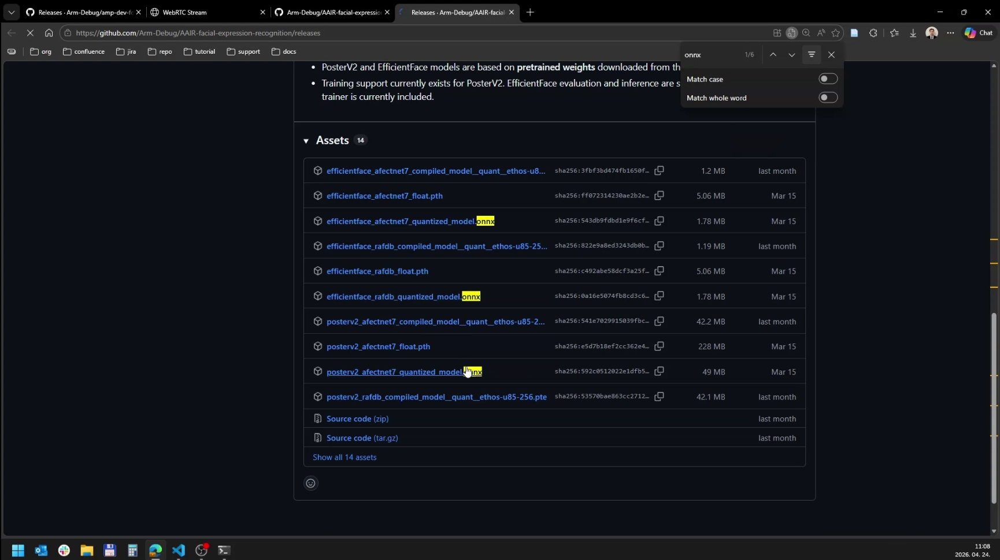
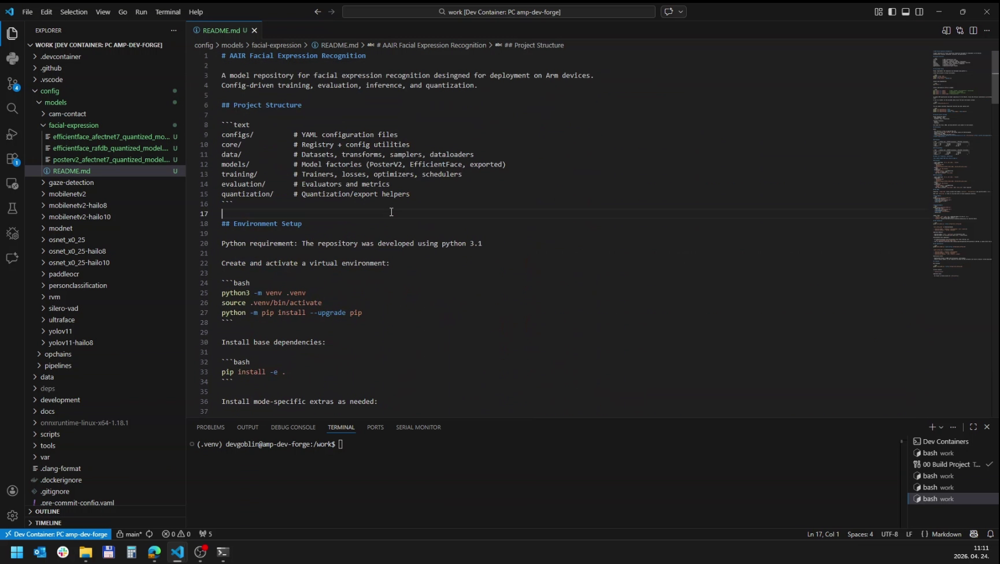
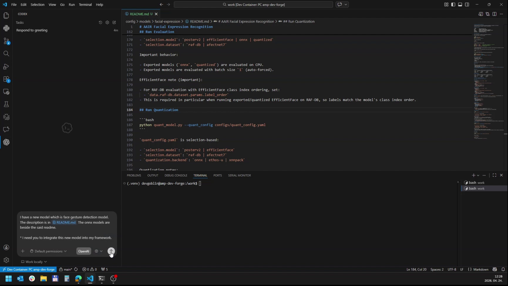

# Exercise Quick Guide

This guide contains three short hands-on exercises for understanding how the repository fits together.

## Before you start

This guide assumes that:

- the repository is already cloned
- the project builds successfully
- `tools/pek-menu` is available

If you only want the shortest setup path first, use one of the platform quick guides and then come back here.

- [Windows/Linux Quick Guide](win-lin.md)
- [Raspberry Pi Quick Guide](rpi.md)
- [macOS Quick Guide](mac.md)

If you want to use your own media during the exercise, use:

```text
data/images/
data/videos/
```

Inside the container, those locations are typically available under:

```text
/work/data/images/
/work/data/videos/
```

## Exercise 1 - Change an existing pipeline
In this exercise, you will start from an existing pipeline and change its source. This lets you compare the output produced by different source types while keeping the rest of the pipeline unchanged.

For simplicity's sake, use the camera-contact pipeline in `config/pipelines/cam-connect.json`. It is available everywhere and is short enough to inspect comfortably.

The beginning of the pipeline contains the active source. The end of the preset lists alternative sources you can copy into place. To change the source, remove the original source section and replace it with a video source, or with a camera source if one is available.

Before:

```json
{
  "description": "Camera contact pipeline with the default image source and peksink video sink.",
  "pipeline": [
    "filesrc location=/work/data/images/katana.jpg !",
    "jpegdec !",
    "imagefreeze !",
    "videoconvert ! video/x-raw,format=BGRA !",
    "pekinfer opchain-path=/work/config/opchains/cam-contact/opchain.json active=false !",
    "pektracker content-type=genericObject !",
    "pekperformance show-all-metrics=true x-offset=20 y-offset=20 font-size=18 alpha=0.9 update-interval=1 !",
    "pekosd enabled=true !",
    "peksink name=sink"
  ]
}
```

After:

```json
{
  "description": "Camera contact pipeline with the default image source and peksink video sink.",
  "pipeline": [
    "filesrc location=/work/data/videos/01.mp4 !",
    "decodebin !",
    "videoconvert !",
    "video/x-raw,format=BGRA !",
    "pekinfer opchain-path=/work/config/opchains/cam-contact/opchain.json active=false !",
    "pektracker content-type=genericObject !",
    "pekperformance show-all-metrics=true x-offset=20 y-offset=20 font-size=18 alpha=0.9 update-interval=1 !",
    "pekosd enabled=true !",
    "peksink name=sink"
  ]
}
```

## Exercise 2 - A new pipeline from scratch
Instead of starting from the most advanced checked-in demo immediately, this exercise builds a pipeline step by step and shows which files in the codebase are responsible for each layer.

The goal is not to invent a new architecture. The goal is to reuse the checked-in codebase and gradually understand:

- how a top-level pipeline preset is written
- how sources and sinks are swapped
- how `pekinfer` is inserted
- how the camera-contact path depends on UltraFace first
- how `pekosd` and `pekperformance` fit into the pipeline
- where the model descriptor, opchain, postprocessing, and visualization logic live

### Step 1: Create a new top-level pipeline preset

Create a new JSON file under:

```text
config/pipelines/
```

For example:

```text
config/pipelines/exercise-camera-contact.json
```

In this repository, this top-level pipeline JSON is the format that `pek-menu` reads.

Start with the smallest valid preset shape:

```json
{
  "description": "Exercise pipeline built step by step.",
  "pipeline": [
    "filesrc location=/work/data/videos/00.mp4 !",
    "decodebin !",
    "videoconvert ! video/x-raw,format=BGRA !",
    "fakesink"
  ]
}
```

This is the first important repository concept:

- `config/pipelines/` holds top-level runnable presets
- the `pipeline` array is concatenated into the final GStreamer pipeline string
- you can evolve the preset incrementally without touching runtime source code yet
- it is often easiest to start with a simple video source first, then switch to a repeated image source when you want a more controlled and easy-to-recognize result

> Expected result: the new preset appears in `pek-menu` and runs a valid video pipeline that ends in `fakesink`.

### Step 2: Use an image source and `fakesink`

Now switch from a video file to a single repeated image while keeping `fakesink` at the end.

The smallest useful image-based pipeline for this exercise is:

```json
{
  "description": "Image source to fakesink.",
  "pipeline": [
    "filesrc location=/work/data/images/katana.jpg !",
    "jpegdec !",
    "imagefreeze !",
    "videoconvert ! video/x-raw,format=BGRA !",
    "fakesink"
  ]
}
```

This is useful because it removes most source-side complexity from the exercise. From this point onward, the next steps can focus on Perception Experience Kit elements rather than on video timing or container decoding.

At this point, you are only proving that:

- the source image can be loaded
  - each premade pipeline contains a set of alternative sources
  - if you run into camera issues, see the [Runtime Deep Dive: Custom camera](../deep-dives/runtime.md#custom-camera) section
- the image is decoded
- the frame is converted into the BGRA format expected by the current video-processing elements

> Expected result: the pipeline runs successfully, but no visible output is produced yet.

### Step 3: Switch to an image source and `filesink`

Now replace `fakesink` with a file-writing sink path.

A minimal example is:

```json
{
  "description": "Image source to filesink.",
  "pipeline": [
    "filesrc location=/work/data/images/katana.jpg !",
    "jpegdec !",
    "imagefreeze !",
    "videoconvert ! video/x-raw,format=BGRA !",
    "videoconvert !",
    "jpegenc !",
    "filesink location=/work/data/exercise-frame.jpg"
  ]
}
```

This step proves that you can swap only the sink side and produce a concrete artifact without changing the source side.

If `/work/data/output/` does not exist yet, create it before running this step.

> Expected result: the pipeline writes a frame to `/work/data/output/exercise-frame.jpg`.

### Step 4: Switch to an image source and `peksink`

Now change the output side to the checked-in browser-facing sink.

```json
{
  "description": "Image source to peksink.",
  "pipeline": [
    "filesrc location=/work/data/images/katana.jpg !",
    "jpegdec !",
    "imagefreeze !",
    "videoconvert ! video/x-raw,format=BGRA !",
    "peksink name=sink"
  ]
}
```

This is the first point where the pipeline becomes visible through the current Perception Experience Kit UI stack.

> Expected result: the pipeline runs and the image is reachable through the current `peksink`-hosted web UI.

### Step 5: Include inference for camera contact

Now insert `pekinfer`.

For this exercise, use the existing checked-in opchain:

```text
/work/config/opchains/cam-contact/opchain.json
```

That opchain already includes both stages needed for the camera-contact flow:

1. UltraFace face detection
2. camera-contact classification on the detected face crops

A first inference-enabled version looks like this:

```json
{
  "description": "Image source with camera-contact inference.",
  "pipeline": [
    "filesrc location=/work/data/images/katana.jpg !",
    "jpegdec !",
    "imagefreeze !",
    "videoconvert ! video/x-raw,format=BGRA !",
    "pekinfer opchain-path=/work/config/opchains/cam-contact/opchain.json active=true !",
    "peksink name=sink"
  ]
}
```

This is an important repository concept: the top-level pipeline does not need to describe every model stage directly. It can delegate the inference logic to an OpChain.
For this exercise, `active=true` keeps the data path obvious and immediate. The shipped demo presets often use `active=false` instead so the web UI can enable models one by one.

> Expected result: the pipeline still runs through `peksink`, but now the buffer also carries `PerceptionMeta` produced by the camera-contact inference chain. At this point since there isn't any overlay the result should not be visible.

### Step 6: Include the OSD element

Now add `pekosd` so the structured results can be drawn onto the frame.

```json
{
  "description": "Image source with camera-contact inference and OSD.",
  "pipeline": [
    "filesrc location=/work/data/images/katana.jpg !",
    "jpegdec !",
    "imagefreeze !",
    "videoconvert ! video/x-raw,format=BGRA !",
    "pekinfer opchain-path=/work/config/opchains/cam-contact/opchain.json active=true !",
    "pekosd enabled=true !",
    "peksink name=sink"
  ]
}
```

At this point, the data path becomes easier to understand:

- `pekinfer` writes structured results into `PerceptionMeta`
- `pekosd` reads `PerceptionMeta`
- `pekosd` draws the supported overlay elements onto the BGRA frame

> Expected result: face detections and camera-contact indicators become visible on the output frame.

### Step 7: Include performance measurement

Now add `pekperformance` before `pekosd`.

```json
{
  "description": "Image source with inference, performance, OSD, and peksink.",
  "pipeline": [
    "filesrc location=/work/data/images/katana.jpg !",
    "jpegdec !",
    "imagefreeze !",
    "videoconvert ! video/x-raw,format=BGRA !",
    "pekinfer opchain-path=/work/config/opchains/cam-contact/opchain.json active=true !",
    "pekperformance show-all-metrics=true x-offset=20 y-offset=20 font-size=18 alpha=0.9 update-interval=1 !",
    "pekosd enabled=true !",
    "peksink name=sink"
  ]
}
```

This is now very close to the checked-in camera-contact preset.
The main difference is that the shipped preset keeps its model inactive by default so it can be enabled from the web UI.

The fully checked-in example to compare against is:

```text
config/pipelines/cam-connect.json
```

> Expected result: the output shows both the normal overlay and the formatted performance overlay text.

### Step 8: For a deeper understanding, inspect the codebase pieces behind the exercise

> The most important idea here is that the top-level pipeline is only the outer shell. This section is for readers who want to understand how the checked-in example is assembled and how a similar integration would be done for their own model. For more detail after reading through this quick exercise, continue with [Bring your model](../deep-dives/bring-your-model.md) and [Custom postprocessing](../deep-dives/custom-postprocessing.md).

The top-level pipeline is only the outer shell. The real camera-contact behavior is split across these files:

- model descriptor
- opchain
- postprocessing parser
- OSD visualization logic

#### Step 8.1: Camera-contact model descriptor

Path:

```text
config/models/cam-contact/model.json
```

Relevant snippet:

```json
{
	"name": "cam_contact",
	"modelFamily": "cam_contact",
	"modelFile": "cam_contact_nitec_rs18-a8w8-ort-quantized.onnx",
	"dynamicOutput": false,
	"contentType": "cameraContact",
	"inputTensors": [
		{
			"shape": [
				1,
				3,
				224,
				224
			],
			"dataKind": "ImageRgbChw",
			"valueType": "Float32",
			"mean": [
				0.485,
				0.456,
				0.406
			],
			"std": [
				0.229,
				0.224,
				0.225
			]
		}
	],
	"outputTensors": [
		{
			"shape": [
				1,
				2
			],
			"dataKind": "RawTensorData",
			"valueType": "Float32"
		}
	]
}
```

This file tells the inference Op what model is being loaded and what tensor contract is expected.

#### Step 8.2: Camera-contact opchain

Path:

```text
config/opchains/cam-contact/opchain.json
```

Relevant snippet:

```json
{
    "name": "CameraContactWithUltraface",
    "ops": [
        {
            "id": "pek-std-ops/InferenceController",
            "attributes": {}
        },
        {
            "id": "pek-std-ops/GenericImagePreprocess",
            "attributes": {
                "inputImageTensorIndex": 0,
                "inputImageSourceName": "pipelineVideoFrame"
            }
        },
        {
            "id": "pek-onnx-ops/Inference",
            "attributes": {
                "modelDescriptor": "/work/config/models/ultraface/model.json"
            }
        },
        {
            "id": "pek-std-ops/GenericPostprocess",
            "attributes": {
                "parser": "UltrafaceParser",
                "normalizeOutputCoordinates": false,
                "confidenceThreshold": 0.3,
                "iouThreshold": 0.1
            }
        },
        {
            "id": "pek-std-ops/InferenceController",
            "loopId": 2,
            "attributes": {
                "contentType": "humanFace"
            }
        },
        {
            "id": "pek-std-ops/GenericImagePreprocess",
            "loopId": 2,
            "attributes": {
                "inputImageTensorIndex": 0,
                "inputImageSourceName": "pipelineVideoFrame"
            }
        },
        {
            "id": "pek-onnx-ops/Inference",
            "loopId": 2,
            "attributes": {
                "modelDescriptor": "/work/config/models/cam-contact/model.json"
            }
        },
        {
            "id": "pek-std-ops/GenericPostprocess",
            "loopId": 2,
            "attributes": {
                "parser": "CameraContactParser",
                "contactClassIndex": 1,
                "noContactClassIndex": 0
            }
        }
    ]
}
```

This is where the two-stage logic lives. The top-level pipeline only sees one `pekinfer`, but the opchain contains both the face detector and the camera-contact classifier.

#### Step 8.3: Camera-contact postprocessing element

Path:

```text
development/ops-std/postproc/CameraContactParser.cpp
```

Relevant snippet:

```cpp
pek::Result<void> CameraContactParser::parse(const pek::TensorParser::Input &input,
                                             pek::Perception::Layer &detectionResult) {
    const auto &tensor = *input.tensors[0];
    const auto shape = tensor.getShape();

    if (shape.dimensionCount != 2 || shape.valueCount[0] != 1 || shape.valueCount[1] != 2) {
        return tl::unexpected(PEK_ERROR(
            pek::ErrorFlag::InvalidData,
            fmt::format("CameraContactParser expects [1,2] logits, got {}", shape.toString())));
    }

    const auto probabilities = softmax2(tensor);
    const int contactClassIndex =
        static_cast<int>(input.attributes.getIntOrDefault("contactClassIndex", 1));
    const int noContactClassIndex =
        static_cast<int>(input.attributes.getIntOrDefault("noContactClassIndex", 0));

    if (contactClassIndex == noContactClassIndex || contactClassIndex < 0 ||
        contactClassIndex > 1 || noContactClassIndex < 0 || noContactClassIndex > 1) {
        return tl::unexpected(PEK_ERROR(
            pek::ErrorFlag::InvalidData,
            fmt::format(
                "CameraContactParser requires distinct class indices in [0,1], got {} and {}",
                contactClassIndex,
                noContactClassIndex)));
    }

    const bool isContact = probabilities[static_cast<size_t>(contactClassIndex)] >=
                           probabilities[static_cast<size_t>(noContactClassIndex)];

    pek::Perception::Classification classification;
    pek::Perception::Classification::Candidate candidate;
    candidate.classId = isContact ? contactClassIndex : noContactClassIndex;
    candidate.confidence = isContact ? probabilities[static_cast<size_t>(contactClassIndex)]
                                     : probabilities[static_cast<size_t>(noContactClassIndex)];
    candidate.text = isContact ? "contact" : "no contact";

    classification.candidates.push_back(candidate);

    detectionResult.contentType = "cameraContact";
    detectionResult.detections.push_back(classification);

    return {};
}
```

This is where the raw `[1,2]` tensor becomes a structured `Perception::Classification` result in a `cameraContact` layer.

#### Step 8.4: Camera-contact OSD visualization

Path:

```text
development/elements/pekosd/pekosd.cpp
```

Relevant snippet:

```cpp
static void drawCameraContactMarkers(Osd::Layer *layer, const pek::Perception &perception) {
    pek::ConstPerceptionTools perceptionTools(perception);

    for (const auto &inferLayer : perception.layers) {
        if (inferLayer.contentType != "cameraContact") {
            continue;
        }

        for (const auto &det : inferLayer.detections) {
            const auto *classification = std::get_if<pek::Perception::Classification>(&det);
            if (!classification || classification->candidates.empty()) {
                continue;
            }

            const auto &candidate = classification->candidates.front();
            if (candidate.classId < 0) {
                continue;
            }

            std::vector<pek::Perception::Rect> parents =
                perceptionTools.getAllRectsWithContentType("humanFace", classification->parentUuid);

            if (parents.empty()) {
                continue;
            }

            const auto &face = parents.front();
            const float x = face.x + face.width * 0.5f;
            const float y = face.y + face.height * 0.5f;
            const bool hasCameraContact = candidate.classId == 1;
            const pek::Color markerColor = hasCameraContact ? pek::Colors::lime : pek::Colors::red;
            const float baseRadius = std::min(face.width, face.height) * 0.5f;
            const float markerRadius = hasCameraContact
                                           ? std::clamp(baseRadius * 0.65f, 18.0f, 80.0f)
                                           : std::clamp(baseRadius * 1.15f, 28.0f, 140.0f);
            const float markerThickness = hasCameraContact ? 5.0f : 8.0f;
            const float centerPointSize = hasCameraContact ? 10.0f : 14.0f;

            Osd::Circle::draw(
                *layer, Osd::Coordinate{x, y}, markerRadius, markerColor, markerThickness);
            Osd::Point::draw(*layer, Osd::Coordinate{x, y}, markerColor, centerPointSize);
        }
    }
}
```

This is where the `cameraContact` `Perception` result is turned into a visual overlay.

### Final comparison with the checked-in preset

Once you have gone through the steps above, compare your exercise pipeline with:

```text
config/pipelines/cam-connect.json
```

That file is the checked-in version of the same idea, with the additional detail that the UI is expected to toggle models on and off:

- image source
- camera-contact opchain
- performance overlay
- OSD
- `peksink`

## Exercise 3 - Agentic AI integration
In this exercise you prepare a new ONNX model integration for an agent.
The important part is not the chat tool itself. The important part is giving the agent the exact model files, repository locations, and tensor contract so it can work inside the intended Perception Experience Kit extension surfaces instead of guessing.

Use this exercise when you have one or more ONNX model artifacts and you want an agent to create or update the model descriptor, opchain, pipeline preset, and parser code if the existing parsers are not enough.

### Step 1: Download the ONNX models

Download the ONNX model artifacts from the model provider or release location you are using for the exercise.


### Step 2: Copy the resources to the correct location

Create one folder per model under:

```text
config/models/<model-id>/
```

Inside the container, the same folder is available under:

```text
/work/config/models/<model-id>/
```

Before prompting the agent, add or copy the model description into:
```text
config/models/<model-id>/README.md
```

Copy the ONNX file and any model-local resources into that folder.



### Step 3: Prompt the agent

Prompt the agent from the repository root so it can read the docs, checked-in examples, and model resources.



### Step 5: Check the result

After the agent finishes, inspect the files it changed before running the pipeline, then build and run the project.

## What should you have at the end of this exercise?

By the end of this guide, you should understand:

- how top-level pipeline presets are defined under `config/pipelines/`
- how sources and sinks can be swapped independently of inference logic
- how one `pekinfer` element can hide a multi-stage opchain
- why camera contact depends on UltraFace first
- how postprocessing turns tensors into `Perception`
- how `pekosd` turns `Perception` into a visible overlay
- how to prepare model files and tensor specs for an agentic integration

You should also be able to swap the example media path with your own file under `/work/data/images/` or `/work/data/videos/` and understand which layer of the repository you are changing when you edit the pipeline preset, the opchain, or the parser.

Success looks like this: you can read a checked-in pipeline, trace it into the model descriptor, opchain, parser, and visualization code, make a small pipeline change without guessing, and prepare a precise prompt for an agent to integrate a new model.
