# Raspberry Pi Quick Guide

This is the shortest path from preparing the Raspberry Pi to running the first AMP pipeline.

Use this page if you want the quickest first run.
Use the longer Raspberry Pi and How-To pages if you want hardware setup details, camera setup details, or troubleshooting help.

## What will you learn from this documentation?

If you follow this page successfully, you will learn how to:

- prepare a remote host for AMP work
- connect to the remote host from VS Code and reopen the repository in the remote host container
- build AMP on the remote host and start `amp-menu`
- run a first pipeline and verify that the Pi-hosted web UI is reachable

At the end of this guide, you should have AMP running on your desk on a Raspberry Pi 5, with the first pipeline launched and the web UI available at `http://raspberrypi.local:9999`.

## 0. Confirm prerequisites

The following section should detail the platform specific prerequisites that this document assumes are already met: [Deep dive prerequisites section](../deep-dives/index.md#prerequisites)

Although not complete, a check script can help the user determine whether the prerequisites are met: "./scripts/pre-req.sh"

Complete the detailed Raspberry Pi hardware, assembly, package, Hailo, SSH, and camera setup in [Raspberry Pi 5: Assembly and Installation Guide](../deep-dives/rpi5.md) before starting this quick guide.

For the quick-start path, you need:

- Raspberry Pi 5
- supported Hailo 8 AI HAT for the `RPI5 H8 amp-dev-forge` container path
- supported Hailo 10 accelerator for the `RPI5 H10 amp-dev-forge` container path
- USB or CSI camera if you plan to use live camera sources
- Docker, Git, camera packages, and the matching Hailo stack on the remote host
- VS Code with the Remote SSH and Dev Containers extensions installed on the host

The primary supported Hailo AI HAT path is Hailo 8. Older Hailo 8L hardware may also work, but Hailo 8 and Hailo 8L compiled model files are not interchangeable.

> Expected result: the Raspberry Pi 5 hardware is assembled, the remote host packages are installed, and the board is ready for VS Code Remote SSH.

## 1. Enable SSH access

Enable SSH on the Raspberry Pi and make sure you can connect to it from your host.

If needed, temporarily enable password authentication in `/etc/ssh/sshd_config`:

```ini
PasswordAuthentication yes
```

After changing the SSH configuration, restart SSH:

```bash
sudo systemctl restart ssh
```

Test the connection from your host:

```bash
ssh pi@raspberrypi.local
```

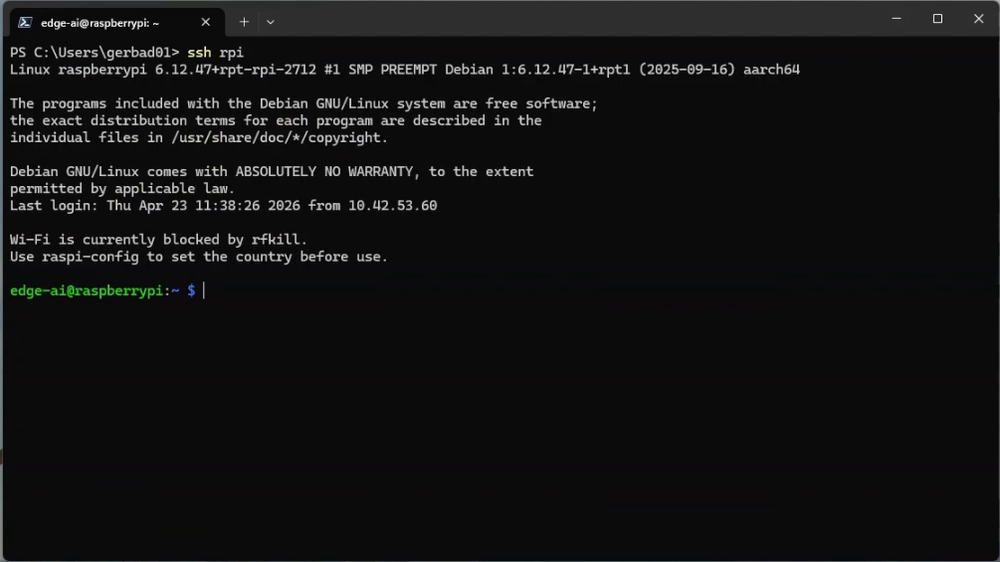

If SSH does not start after boot, or if `raspberrypi.local` does not resolve, see [Troubleshooting: Raspberry Pi SSH and mDNS](../deep-dives/troubleshooting.md#raspberry-pi-ssh-and-mdns).

For key creation details, see [Generating a new SSH key and adding it to the ssh-agent](https://docs.github.com/en/authentication/connecting-to-github-with-ssh/generating-a-new-ssh-key-and-adding-it-to-the-ssh-agent).

> Expected result: you can connect to the remote host from your host over SSH.

## 2. Prepare the Raspberry Pi host

Follow [Raspberry Pi 5: Assembly and Installation Guide](../deep-dives/rpi5.md) for the exact system update, PCIe, package, camera, and Hailo installation commands.

> Expected result: the remote host has the required packages installed and the relevant Hailo stack is enabled and validated before the remote host container is started.

## 3. Clone the repository on the Raspberry Pi

In order to download the latest release archive download the compressed source package from the [release page](https://github.com/Arm-Debug/amp-dev-forge/releases) and extract it before continuing.
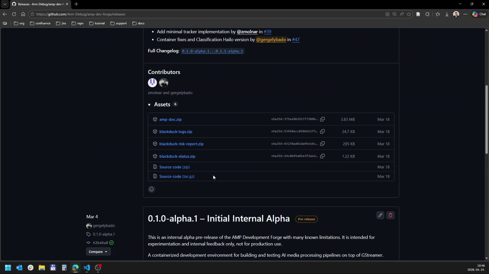

Extract the ZIP archive:

```bash
# If unzip is missing:
sudo apt-get install -y unzip

unzip amp-dev-forge-${VERSION}.zip
mv amp-dev-forge-${VERSION} amp-dev-forge
cd amp-dev-forge
```

Or download and extract the tar archive:

```bash
VERSION=<version>
curl -L -o amp-dev-forge-${VERSION}.tar.gz \
  "https://github.com/Arm-Debug/amp-dev-forge/archive/refs/tags/${VERSION}.tar.gz"
tar -xzf amp-dev-forge-${VERSION}.tar.gz
mv amp-dev-forge-${VERSION} amp-dev-forge
cd amp-dev-forge
```

If you use the archive path, continue from the next step after `cd amp-dev-forge`.

Alternatively SSH access is working, clone the repository on the Raspberry Pi:

```bash
git clone git@github.com:Arm-Debug/amp-dev-forge.git
cd amp-dev-forge
```

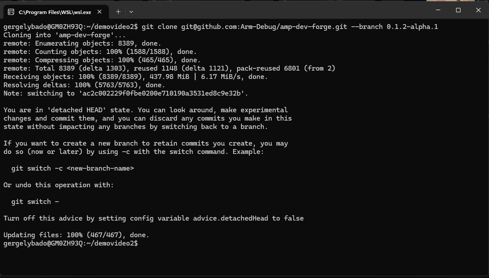

> Expected result: the repository is present on the Raspberry Pi and ready to be opened remotely from VS Code.

## 4. Open the Raspberry Pi in VS Code

From your host:
- connect to the Raspberry Pi over Remote SSH in VS Code
- open the cloned repository folder
- open the Command Palette with `Ctrl+Shift+P` or `Cmd+Shift+P`
- run `Dev Containers: Reopen in Container`

Use the Remote SSH entry point in VS Code to open a remote window.

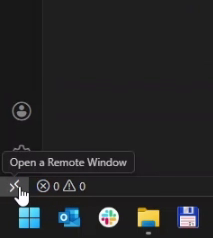

You can also start the same flow from the command palette.

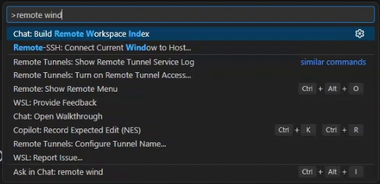

Select the SSH configuration for your Raspberry Pi.


Once VS Code is connected to the Pi, reopen the cloned repository folder.

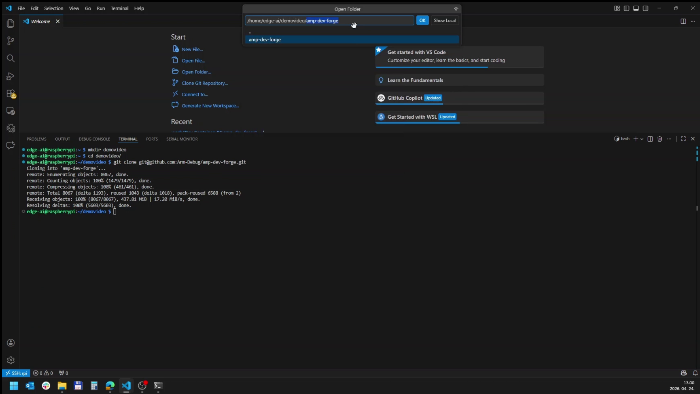

Choose the matching container:

- `RPI5 H8 amp-dev-forge` for Hailo 8 work
- `RPI5 H10 amp-dev-forge` for Hailo 10 work


Wait until the remote host container finishes building. With a good connection and SSD, this usually takes around 6 minutes.

> Expected result: VS Code reconnects into the remote host container and the project opens with the container environment active.

## 5. Build the project

Use the build task in VS Code:
- open the Command Palette and run `Tasks: Run Task`
- run **00 Build Project**

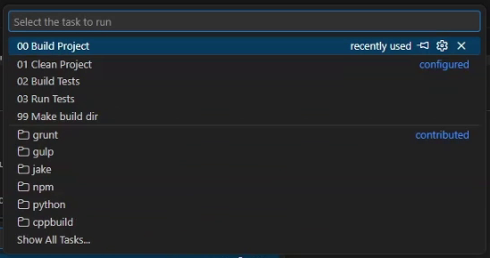

Or build in the active remote host container terminal from the project root:

```bash
./scripts/build-elements.sh debug false
```

> Expected result: the build completes successfully and `tools/amp-menu` is available on the Raspberry Pi.

## 6. Start AMP

Use the VS Code run task:

- open the Command Palette and run `Tasks: Run Task`
- run **00 Run project and select pipeline**
- choose `01-full-onnx`

The menu view is also available through **00 Run project with menu**.

You can also run the menu in a new terminal inside the active remote host container from the project root:

```bash
./tools/amp-menu
```

The menu should show the available pipeline presets.


Stop:

To stop an application that was not started from a VS Code launch configuration, press Ctrl+C in the console.

> Expected result: the selected task or `amp-menu` starts and either launches the selected pipeline or shows the pipeline selection menu.

> Disclaimer. During GStreamer pipeline runs, some errors caused by browser connection issues or dropped frames are expected. These can be ignored; a more verbose logging system is in progress.

## 7. Run the example pipeline

For the shortest first run, choose `01-full-onnx`.
If you opened the interactive menu, type the corresponding number and press Enter.

This is the shortest recommended first pipeline.

If you specifically want the Hailo-accelerated path after that, use:
- `02-full-onnx-hailo8.json` for the Hailo 8 path
- `03-full-onnx-hailo8l.json` for Hailo 8L hardware with Hailo 8L-compiled models
- `04-full-onnx-hailo10.json` for the Hailo 10 path

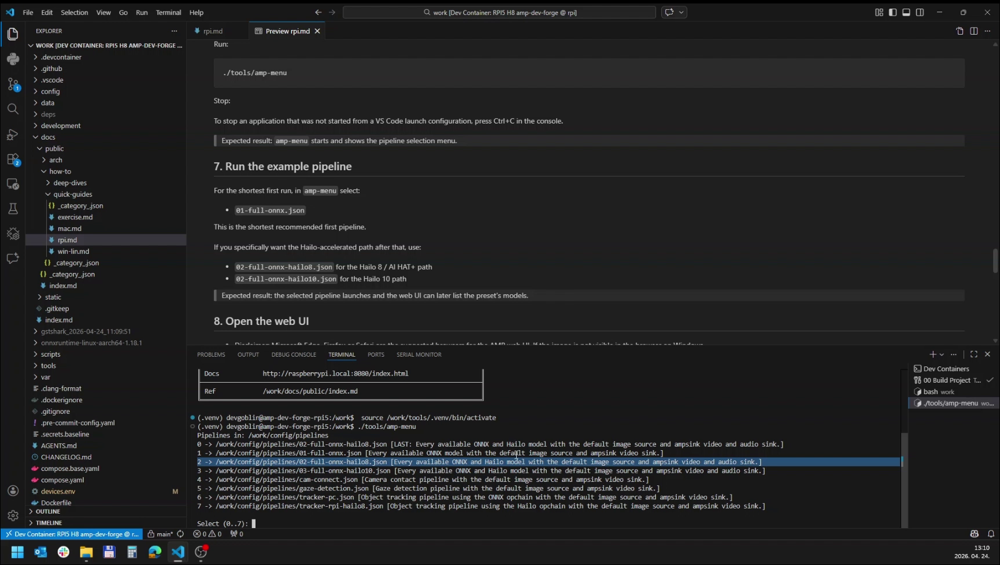

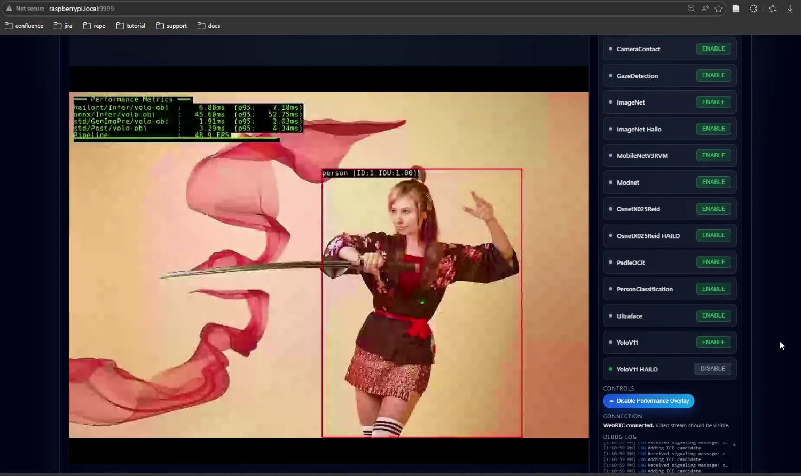

> Expected result: the selected pipeline launches and the web UI can later list the preset's models.

## 8. Open the web UI

Microsoft Edge, Firefox or Safari are the suggested browsers for the AMP web UI. If the image is not visible, or if `raspberrypi.local` does not resolve, see [Troubleshooting](../deep-dives/troubleshooting.md).

Open:
- http://raspberrypi.local:9999

Documentation is available at:
- http://raspberrypi.local:8080

In the **AI Models** panel, enable one or more models to start inference.
The main demo presets register their models as inactive by default so you can switch them on individually.


Use the model controls to enable or disable selected models. The demo presets usually start with models disabled, so this is the normal way to begin inference after the page opens.

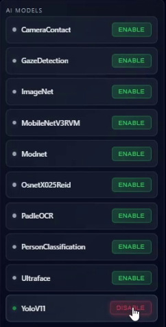

The performance overlay is available after at least one model is enabled.

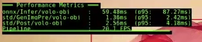

Use the performance overlay button to show or hide the performance data.


The log window shows browser-side connection messages and RTC connection debug data. Use it when the web UI opens but the video connection is unstable or does not appear.

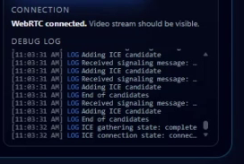

> Expected result: the AMP UI opens from another machine on the network, the documentation endpoint is reachable, and enabled models begin producing overlays or results.

## 9. Run it again later without the menu

After you have selected a pipeline once, you can rerun the last selection with the -l (latest) argument:

The VS Code task for this is **00 Run project with latest pipeline**.

```bash
./tools/amp-menu -l
```

> Expected result: AMP starts the most recently selected pipeline directly without showing the menu.

## If you want the deeper guides

Continue with the [deep dive how-to guide](../deep-dives/index.md).

If you want a guided repository walk-through, continue with the [exercise quick guide](exercise.md).

## What should you have at the end of this document?

By the end of this guide, you should have:

- a prepared Raspberry Pi 5 host with the required packages
- working SSH access from your host
- a working remote host container on the Pi
- a successful build
- at least one AMP pipeline started from the VS Code task or `amp-menu`
- the AMP web UI reachable at `http://raspberrypi.local:9999`

Success looks like this: VS Code connects to the Pi, the container opens, the project builds, the pipeline starts, and the web UI is reachable from your browser.
