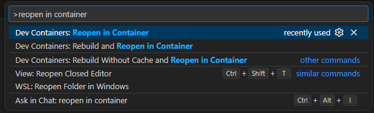
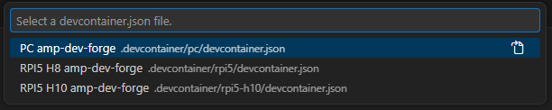
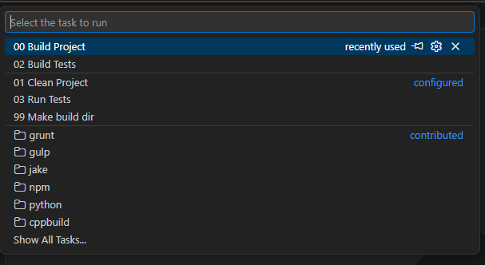
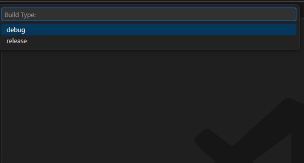

# Raspberry Pi Quick Guide

This is the shortest path from preparing the Raspberry Pi to running the first AMP pipeline.

Use this page if you want the quickest first run.
Use the longer Raspberry Pi and How-To pages if you want hardware setup details, camera setup details, or troubleshooting help.

## What will you learn from this documentation?

If you follow this page successfully, you will learn how to:

- prepare a Raspberry Pi 5 host for AMP work
- connect to the target from VS Code and reopen the repository in the container
- build AMP on the target and start `amp-menu`
- run a first pipeline and verify that the Pi-hosted web UI is reachable

At the end of this guide, you should have AMP running on your desk on a Raspberry Pi 5, with the first pipeline launched and the web UI available at `http://raspberrypi.local:9999`.

## 0. Required devices and access to the device
For other hardware setups, use the deeper Raspberry Pi guide.

- [Raspberry Pi 5 16GB](https://www.raspberrypi.com/products/raspberry-pi-5/)
- [AI HAT+](https://www.raspberrypi.com/products/ai-hat/) for the Hailo 8 path
- a supported Hailo 10 accelerator if you plan to use the `RPI5 H10 amp-dev-forge` container
- [Camera Module v3](https://www.raspberrypi.com/products/camera-module-3/)

### Assembly

1.  Attach spacers to the Raspberry Pi 5.
2.  Mount the AI HAT+ 2 onto the GPIO header.
3.  Connect the PCIe ribbon cable:
    -   From the Raspberry Pi 5 PCIe port to the HAT
    -   Ensure copper contacts face **up on the HAT side**
4.  Install the heatsink onto the Hailo chip on the HAT.
5.  Connect the power supply.

Follow the [Basic instructions](https://www.raspberrypi.com/documentation/computers/getting-started.html) guide to create a headless Trixie installation and install the selected image.

SSH can also be configured using the installer. Sometimes, even when SSH is enabled, it may not work out of the box after boot. In that case, create an empty file named `ssh` in the root folder of `bootfs`.

> Expected result: you have the minimum supported Raspberry Pi hardware in place for the quick-start path.

## 1. Enable SSH access

Enable SSH on the Raspberry Pi and make sure you can connect to it from your development machine.

If needed, temporarily enable password authentication in `/etc/ssh/sshd_config`:

```ini
PasswordAuthentication yes
```

> Expected result: you can connect to the Raspberry Pi from your development machine over SSH.

## 2. Prepare the Raspberry Pi host

### Update System

``` bash
sudo apt update
sudo apt full-upgrade -y
sudo rpi-eeprom-update -a
```

### Enable PCIe Gen 3

``` bash
sudo raspi-config
```
-   Navigate to: Advanced Options → PCIe Speed → Enable Gen 3

### Additional packages
```bash
sudo apt-get update
sudo apt-get install -y git docker.io v4l-utils raspi-utils-core raspi-utils-dt
sudo apt-get install rpicam-apps libcamera-dev libcamera-doc libcamera-tools \
  gstreamer1.0-tools gstreamer1.0-plugins-good gstreamer1.0-plugins-bad gstreamer1.0-plugins-ugly gstreamer1.0-gl \
  libgstreamer1.0-dev libgstreamer-plugins-base1.0-dev libgstreamer-plugins-bad1.0-dev \
  gstreamer1.0-libcamera \
  ffmpeg \
  code cmake libcairo2-dev libssl-dev
```

## Hailo installation

The `RPI5 H10 amp-dev-forge` and `RPI5 H8 amp-dev-forge` container only adds the Hailo 10 user-space packages. Kernel or PCIe driver packages such as `hailort-pcie-driver` or `h10-hailort-pcie-driver` stay on the Raspberry Pi host.

### Hailo8

If you are using the Hailo 8 / AI HAT+ path, install the required tools:

```sh
sudo apt-get update
sudo apt-get install dkms
sudo apt-get install hailo-all
sudo reboot
```

### Hailo10

If you are using the Hailo 10 path, install the required host-side Hailo 10 driver stack first.

``` bash
sudo apt install dkms
sudo apt install hailo-h10-all
sudo reboot
```

### Verify Installation

After the host-side Hailo 10 setup, confirm that the device nodes exist:

```sh
ls /dev/hailo*
```

``` bash
hailortcli fw-control identify
```

-   Confirm output includes: Device Architecture: HAILO10H
Example:
``` bash
pi@rpi-5:~ $ hailortcli fw-control identify
Executing on device: 0001:03:00.0
Identifying board
Control Protocol Version: 2
Firmware Version: 5.1.1 (release,app)
Logger Version: 0
Device Architecture: HAILO10H
```

> Expected result: the Raspberry Pi host has the required packages installed and, for the Hailo 10 path, the host-side Hailo 10 stack is enabled and validated before the Dev Container is started.

## 3. Clone the repository on the Raspberry Pi

After SSH access is working, clone the repository on the Raspberry Pi:

```bash
git clone git@github.com:Arm-Debug/amp-dev-forge.git
cd amp-dev-forge
```

> Expected result: the repository is present on the Raspberry Pi and ready to be opened remotely from VS Code.

## 4. Open the Raspberry Pi in VS Code

From your development machine:
- connect to the Raspberry Pi over Remote SSH in VS Code
- open the cloned repository folder
- open the Command Palette with `Ctrl+Shift+P` or `Cmd+Shift+P`
- run `Dev Containers: Reopen in Container`

Choose the matching container:

- `RPI5 H8 amp-dev-forge` for Hailo 8 / AI HAT+ work
- `RPI5 H10 amp-dev-forge` for Hailo 10 work





Wait until the Dev Container finishes building.

> Expected result: VS Code reconnects into the Raspberry Pi container and the project opens with the container environment active.

## 5. Build the project

Use the build task in VS Code:
- open the Command Palette and run `Tasks: Run Task`
- run **00 Build Project**
- choose `debug` unless you specifically want `release`





Or build in the container terminal:

```bash
./scripts/build-elements.sh debug false
```

> Expected result: the build completes successfully and `tools/amp-menu` is available on the Raspberry Pi.

## 6. Start AMP

Run:

```bash
./tools/amp-menu
```

Stop:

To stop an application that was not started from a VS Code launch configuration, press Ctrl+C in the console.

> Expected result: `amp-menu` starts and shows the pipeline selection menu.


## 7. Run the example pipeline

For the shortest first run, in `amp-menu` select:
- `01-full-onnx.json`

This is the shortest recommended first pipeline.

If you specifically want the Hailo-accelerated path after that, use:
- `02-full-onnx-hailo8.json` for the Hailo 8 / AI HAT+ path
- `02-full-onnx-hailo10.json` for the Hailo 10 path

> Expected result: the selected pipeline launches and the web UI can later list the preset's models.

## 8. Open the web UI

- Disclaimer: Microsoft Edge, Firefox or Safari are the suggested browsers for the AMP web UI. If the image is not visible in the browser on Windows
   - Edge: open `edge://flags/`, find `#enable-webrtc-hide-local-ips-with-mdns`, and disable it.
   - Firefox: `about:config`, find media.peerconnection.ice.obfuscate_host_addresses, and disable it.

For Mac users, mDNS might not work, so instead of typing `raspberrypi.local`, use the Raspberry Pi’s IP address.

Open:
- http://raspberrypi.local:9999

Documentation is available at:
- http://raspberrypi.local:8080

In the **AI Models** panel, enable one or more models to start inference.
The main demo presets register their models as inactive by default so you can switch them on individually.

> Expected result: the AMP UI opens from another machine on the network, the documentation endpoint is reachable, and enabled models begin producing overlays or results.

## 9. Run it again later without the menu

After you have selected a pipeline once, you can rerun the last selection with the -l (latest) argument:

```bash
./tools/amp-menu -l
```

> Expected result: AMP starts the most recently selected pipeline directly without showing the menu.

## If you want the deeper guides

Continue with the [main how-to guide](../deep-dives/index.md).

If you want a guided repository walk-through, continue with the [exercise quick guide](exercise.md).

## What should you have at the end of this document?

By the end of this guide, you should have:

- a prepared Raspberry Pi 5 host with the required packages
- working SSH access from your development machine
- a working Dev Container on the Pi
- a successful build
- at least one AMP pipeline started from `amp-menu`
- the AMP web UI reachable at `http://raspberrypi.local:9999`

Success looks like this: VS Code connects to the Pi, the container opens, the project builds, the pipeline starts, and the web UI is reachable from your browser.
