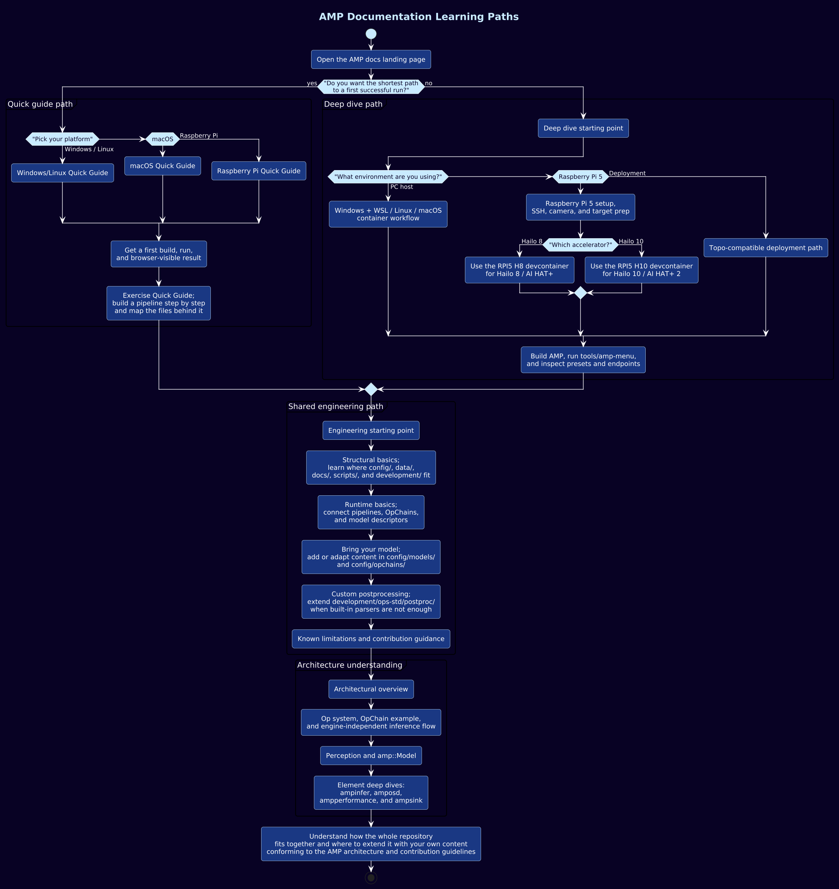

# AMP Development Forge documentation

This documentation is split into two main paths:

- **How-to guides** for cloning, building, running, and integrating content
- **Architecture docs** for runtime structure, execution flow, and implementation detail

## Choose a documentation path

Use this flowchart when you are deciding how deep to go first.
The quick-guide path is the fastest way to reach a working pipeline and then reconnect through the [Exercise Quick Guide](how-to/quick-guides/exercise.md) into the same engineering path as the full setup flow.
The deep-dive path branches by platform and Raspberry Pi accelerator choice, then continues into model integration, custom postprocessing, and the architecture pages.

## Start with the path you need

### Quick first run

- [Windows/Linux quick guide](how-to/quick-guides/win-lin.md)
- [macOS quick guide](how-to/quick-guides/mac.md)
- [Raspberry Pi quick guide](how-to/quick-guides/rpi.md)

### Fuller setup and usage

- [Main how-to guide](how-to/deep-dives/index.md)
- [Engineering starting point](how-to/deep-dives/engineering.md)
- [Bring your model](how-to/deep-dives/bring-your-model.md)
- [Performix setup](how-to/deep-dives/performix-setup.md)

### Architecture and implementation detail

- [Architecture index](arch/index.md)
- [Architectural overview](arch/architectural-overview.md)
- [ampinfer](arch/elements/ampinfer.md)
- [amposd](arch/elements/amposd.md)
- [ampperformance](arch/elements/ampperformance.md)
- [ampsink](arch/elements/ampsink.md)

## Documentation structure

- [how-to](how-to) contains task-oriented user and integrator guides
- [arch](arch) contains runtime, data-model, and element documentation

Use the how-to pages when you want to get work done.
Use the architecture pages when you want to understand or modify the implementation.
