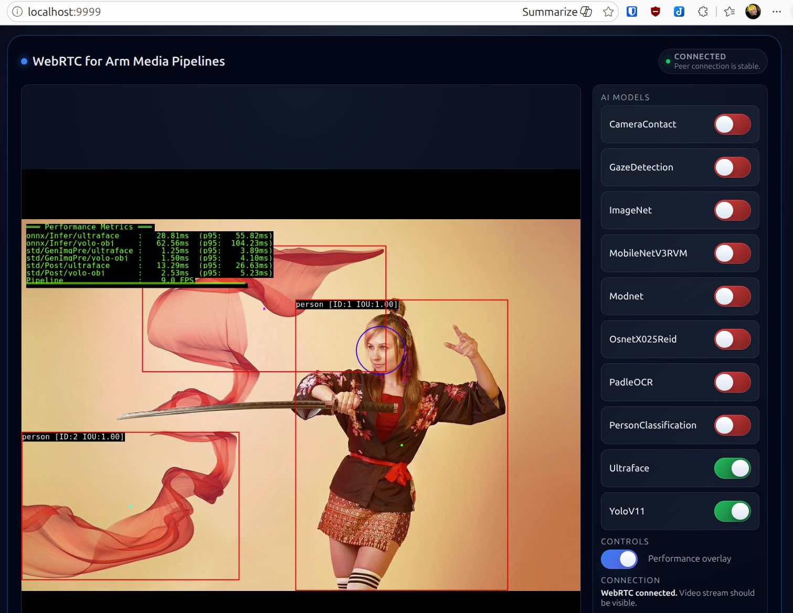

# AMP Development Forge Documentation

AMP Development Forge helps you run AI media-processing pipelines in a repeatable container environment. In this guide, media mostly means video frames from an image, video file, or camera feed. A pipeline can read that media, run one or more AI models, and show the result in a browser.



## Start Here

Choose the first page from this table:

| I have or want... | Start with... |
|---|---|
| Raspberry Pi 5 with a supported Hailo accelerator | [Raspberry Pi 5 Tutorial](raspberry-pi-quick-start.md) |
| Windows PC | [Windows Quick Start](windows-quick-start.md) |
| Linux PC | [Linux Quick Start](linux-quick-start.md) |
| Mac | [macOS Quick Start](macos-quick-start.md) |
| A working first run and want to understand the folders | [Structural Basics](structural-basics.md) |
| A working first run and want to understand pipelines | [Runtime Basics](runtime-basics.md) |
| A working first run and want to use a camera | [Use A Camera](camera-input.md) |
| A working first run and want to add a model | [Bring Your Model](bring-your-model.md) |
| A model whose output is not supported yet | [Custom Postprocessing](custom-postprocessing.md) |

The recommended first tutorial is:

- [Raspberry Pi 5 Tutorial](raspberry-pi-quick-start.md)

Use the Raspberry Pi tutorial if you have a Raspberry Pi 5 and a supported Hailo accelerator. It walks through the full path from hardware checks to first inference in the browser.

If you do not have Raspberry Pi hardware, use one of these PC tutorials:

- [Windows Quick Start](windows-quick-start.md)
- [Linux Quick Start](linux-quick-start.md)
- [macOS Quick Start](macos-quick-start.md)

## What You Will Run First

The first tutorial runs the `01-full-onnx` pipeline. It uses checked-in sample media first, because this is the most reliable way to prove that the environment, build, pipeline, and browser UI are working.

The first pipeline includes these model families:

- object detection
- face detection
- camera-contact classification
- gaze detection
- image classification
- segmentation
- object embedding
- OCR
- person classification

After the first inference works, the Raspberry Pi tutorial shows where to try the Hailo pipelines. Use [Use A Camera](camera-input.md) when you are ready to switch from sample media to a camera source.

## What Success Looks Like

When the first run is working:

- the AMP browser UI opens
- the sample media is visible
- the **AI Models** panel is visible
- you can enable one model from the **AI Models** panel
- an overlay or result appears after a model is enabled

The browser result is the important success check. A terminal message such as `playing` or `connected` is useful, but it does not by itself prove that inference is visible in the UI.

## Normal First-Run Behavior

The first run is intentionally conservative:

- the quick-start pipeline uses checked-in sample media, not your camera
- models usually start disabled
- enable one model first, such as `yolov11` or `mobilenetv2`
- some GStreamer or browser-connection warnings can appear while the pipeline is running
- keep the terminal running while the browser UI is open

Switch to a camera only after the first sample-media run works.

## Terms You Will See

- **Host** means your normal Windows, Linux, or macOS computer.
- **Raspberry Pi** means the Pi device that runs AMP in the Raspberry Pi tutorial.
- **Pipeline** means a saved runtime preset that chooses input, models, and output.
- **Model** means an AI model and its descriptor files.
- **Dev Container** means the Docker-based development environment opened by VS Code.

## Shell Names Used In These Guides

The guides label commands by where they must run.

- **Host shell** means the normal terminal on your Windows, Linux, or macOS computer.
- **WSL shell** means the Ubuntu/Linux terminal inside WSL on Windows.
- **Raspberry Pi shell** means a terminal connected to the Raspberry Pi, usually through SSH.
- **Docker shell** means the terminal inside the VS Code Dev Container after you choose **Dev Containers: Reopen in Container**.

If a command says **Docker shell**, do not run it in your normal terminal. Open a terminal in VS Code after the container has started.

## First Success Target

The first useful success signal is:

1. The project opens in the correct VS Code Dev Container.
2. The build task finishes without errors.
3. `amp-menu` starts a pipeline.
4. The AMP web UI opens in a browser.
5. At least one model can be enabled from the **AI Models** panel.

For a PC or Mac, the web UI is:

```text
http://localhost:9999
```

The local documentation endpoint is:

```text
http://localhost:8080
```

For a Raspberry Pi, the web UI is usually:

```text
http://raspberrypi.local:9999
```

The Raspberry Pi documentation endpoint is usually:

```text
http://raspberrypi.local:8080
```

The default first pipeline is `01-full-onnx`. It uses sample media by default. Some pipeline files also contain alternative camera and video sources, but the first run should prove the basic build and browser path before you change inputs.

AMP also uses ports `8000` and `8001` internally for browser-facing runtime communication.

## Advanced Topics

Use these after a quick start is working:

- [Structural Basics](structural-basics.md) - where models, pipelines, media files, scripts, and source changes live.
- [Runtime Basics](runtime-basics.md) - how AMP uses pipelines, OpChains, model descriptors, and browser output.
- [Use A Camera](camera-input.md) - how to switch from sample media to USB or Raspberry Pi CSI camera input.
- [Bring Your Model](bring-your-model.md) - how to add a model by reusing existing descriptors, OpChains, and parsers.
- [Custom Postprocessing](custom-postprocessing.md) - how to add a parser when existing tensor parsers do not match your model output.
- [Performance Measurement With Performix](performance-measurement.md) - how to connect Performix and run a measurement recipe.

## Optional Setup Pages

- [Raspberry Pi SSH Setup](raspberry-pi-ssh.md) - use this before the Raspberry Pi tutorial if you want to connect from your normal computer.
- [GitHub SSH Key Setup](github-ssh-key.md) - use this only if you need to clone from GitHub with an SSH URL.
