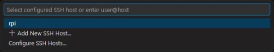
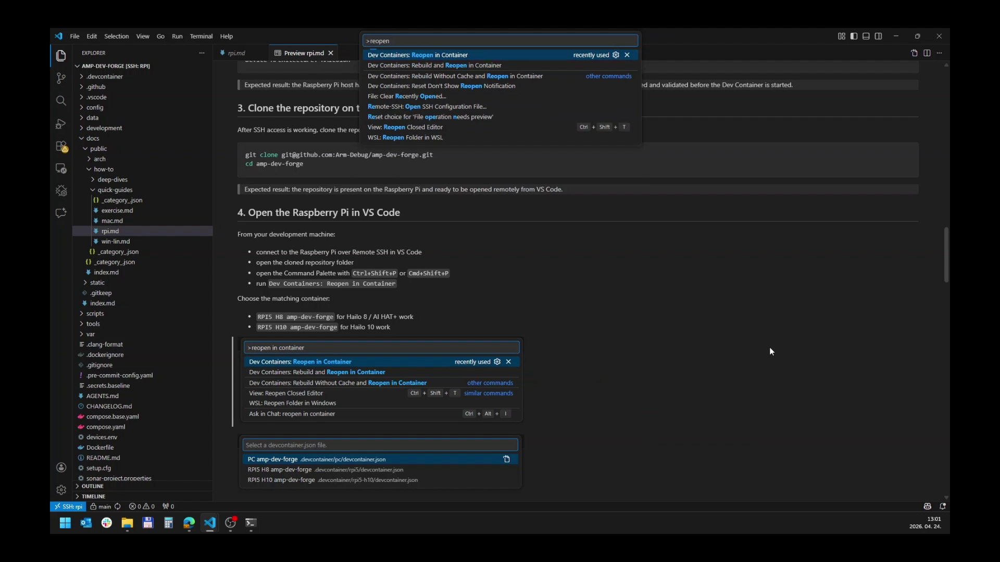

# Raspberry Pi 5 Tutorial

Use this tutorial when AMP will run on a Raspberry Pi 5. Your normal computer is used to connect with VS Code. The build, container, and pipeline run on the Raspberry Pi.

This page follows the intended first-user path:

1. Check the hardware.
2. Flash Raspberry Pi OS and enable SSH.
3. Connect to the Pi.
4. Install Pi prerequisites.
5. Clone AMP on the Pi.
6. Open AMP from VS Code.
7. Prepare the Dev Container.
8. Build and run the first pipeline.
9. See first inference in the browser.
10. Try a camera source after first success.

## 1. Check The Hardware

You need:

- Raspberry Pi 5.
- Raspberry Pi OS based on Debian Trixie.
- Supported Hailo 8 AI HAT, Hailo 8L hardware with matching compiled models, or supported Hailo 10 accelerator.
- Network connection between your normal computer and the Raspberry Pi.
- Power supply suitable for Raspberry Pi 5 and attached hardware.
- Optional camera. The first run uses a static image, so the camera is not required for first success.

The first tutorial can run without Hailo by using the ONNX pipeline. Hailo is needed for the Hailo-specific pipelines later in this page.

## 2. Flash Raspberry Pi OS And Enable SSH

The best way to enable SSH is during imaging. That lets you control the Pi from your normal computer without connecting a monitor and keyboard.

Follow [Raspberry Pi SSH Setup](raspberry-pi-ssh.md) before you continue if SSH is not already working.

Expected result: this command works from your normal computer in the **host shell**:

```bash
ssh <username>@raspberrypi.local
```

If `raspberrypi.local` does not work, use the Raspberry Pi IP address:

```bash
ssh <username>@<raspberry-pi-ip-address>
```

## 3. Connect To The Raspberry Pi

Run on your normal computer in the **host shell**:

```bash
ssh <username>@raspberrypi.local
```

After login, you are in the **Raspberry Pi shell**. The next commands run on the Pi.

## 4. Update The Pi And Install Base Packages

Run in the **Raspberry Pi shell**:

```bash
sudo apt update
sudo apt full-upgrade -y
sudo rpi-eeprom-update -a
```

Install the base packages:

```bash
sudo apt-get update
sudo apt-get install -y git docker.io docker-compose-plugin v4l-utils raspi-utils-core raspi-utils-dt
sudo apt-get install -y rpicam-apps libcamera-dev libcamera-doc libcamera-tools
sudo apt-get install -y gstreamer1.0-tools gstreamer1.0-plugins-good gstreamer1.0-plugins-bad gstreamer1.0-plugins-ugly gstreamer1.0-gl
sudo apt-get install -y libgstreamer1.0-dev libgstreamer-plugins-base1.0-dev libgstreamer-plugins-bad1.0-dev gstreamer1.0-libcamera
sudo apt-get install -y libcairo2-dev libssl-dev
```

If you use the Hailo 8 AI HAT, install the Hailo 8 stack:

```bash
sudo apt-get install -y dkms
sudo apt-get install -y hailo-all
sudo reboot
```

If you use a supported Hailo 10 accelerator, install the Hailo 10 stack:

```bash
sudo apt-get install -y dkms
sudo apt-get install -y hailo-h10-all
sudo reboot
```

After reboot, reconnect with SSH.

## 5. Run A Preflight Check

Run in the **Raspberry Pi shell**:

```bash
docker --version
docker compose version
git --version
```

If you installed Hailo, also run:

```bash
ls /dev/hailo*
hailortcli fw-control identify
```

Expected result:

- Docker prints a version.
- Git prints a version.
- `hailortcli` prints the Hailo device architecture, such as `HAILO8` or `HAILO10H`.

If these checks fail, fix them before opening the project in VS Code. The Dev Container depends on the Pi host setup.

After AMP is cloned in the next step, the repository also contains `./scripts/pre-req.sh`. Treat it as an extra helper check, not as a replacement for the checks above.

## 6. Clone AMP On The Raspberry Pi

Run in the **Raspberry Pi shell**:

```bash
git clone https://github.com/Arm-Debug/amp-dev-forge.git
cd amp-dev-forge
```

HTTPS cloning is the simplest first path. If you must clone with SSH, use [GitHub SSH Key Setup](github-ssh-key.md).

Expected result: the `amp-dev-forge` folder exists on the Raspberry Pi.

## 7. Check VS Code Prerequisites On Your Computer

On your normal computer, install:

- Visual Studio Code.
- VS Code **Remote - SSH** extension.
- VS Code **Dev Containers** extension.

These extensions are required before you connect to the Pi with VS Code.

## 8. Open The Pi From VS Code

On your normal computer, open VS Code.

1. Open the Command Palette.
   - Windows/Linux: `Ctrl+Shift+P`.
   - macOS: `Cmd+Shift+P`.
2. Run **Remote-SSH: Connect to Host...**.


3. Choose or enter:

```text
<username>@raspberrypi.local
```

If `.local` did not work in the terminal, use the IP address instead:

```text
<username>@<raspberry-pi-ip-address>
```



Expected result: VS Code opens a remote window connected to the Raspberry Pi.

## 9. Open The AMP Folder And Prepare The Container

In the VS Code remote window:

1. Open the `amp-dev-forge` folder on the Raspberry Pi.


2. Open the Command Palette.
3. Run **Dev Containers: Reopen in Container**.



4. Choose the container for your hardware:
   - **RPI5 H8 amp-dev-forge** for Hailo 8 or Hailo 8L work.
   - **RPI5 H10 amp-dev-forge** for Hailo 10 work.

VS Code may say that it is building the container. Think of this as preparing the AMP environment. It can take several minutes on the first run.

Expected result: VS Code reloads and opens the repository inside the Dev Container. A new VS Code terminal is now the **Docker shell on the Raspberry Pi**.


## 10. Build The Project

Run in the **Docker shell on the Raspberry Pi**:

```bash
./scripts/build-elements.sh debug false
```

You can also use the VS Code task:

1. Open the Command Palette.
2. Run **Tasks: Run Task**.
3. Choose **00 Build Project**.


Expected result: the build finishes without errors and `tools/amp-menu` exists.

## 11. Run The First Pipeline

A pipeline is a saved runtime preset. It tells AMP where the input comes from, which models can run, and where the result is shown. The first pipeline uses a static image so you can confirm the system works before changing to a camera.

Run in the **Docker shell on the Raspberry Pi**:

```bash
./tools/amp-menu 01-full-onnx
```

Leave this terminal open. The pipeline is running while this command is active.

Expected result: AMP starts the `01-full-onnx` pipeline. This pipeline uses a static image and ONNX models.


## 12. Open The Web UI

Open a browser on your normal computer:

```text
http://raspberrypi.local:9999
```

If that does not work, use the Pi IP address:

```text
http://<raspberry-pi-ip-address>:9999
```

In the **AI Models** panel, enable one model first. Start with `yolov11` or `mobilenetv2`.


Expected result: the page shows the AMP view and enabling a model produces an overlay or result. The first pipeline uses a static image, so it is normal that you do not see a live camera feed yet.

## 13. Try A Hailo Pipeline

Only do this after `01-full-onnx` works.

Stop the running pipeline with `Ctrl+C` in the **Docker shell on the Raspberry Pi**.

For Hailo 8, run:

```bash
./tools/amp-menu 02-full-onnx-hailo8
```

For Hailo 8L hardware with Hailo 8L-compiled models, run:

```bash
./tools/amp-menu 03-full-onnx-hailo8l
```

For Hailo 10, run:

```bash
./tools/amp-menu 04-full-onnx-hailo10
```

Open the same browser URL and enable one model in the **AI Models** panel.

## 14. Switch From Static Image To Camera

The checked-in quick-start pipelines use a static image by default. This keeps the first run predictable.

The pipeline files already contain alternative camera sources:

- `alternative-source-usbcam` for USB cameras.
- `alternative-source-raspicam` for Raspberry Pi CSI cameras.

Open one of these files in VS Code:

- `config/pipelines/01-full-onnx.json`
- `config/pipelines/02-full-onnx-hailo8.json`
- `config/pipelines/03-full-onnx-hailo8l.json`
- `config/pipelines/04-full-onnx-hailo10.json`

For a USB camera, check the device path in the **Raspberry Pi shell**:

```bash
v4l2-ctl --list-devices
```

For a CSI camera, check the camera name in the **Raspberry Pi shell**:

```bash
rpicam-hello --list-cameras
```

Then copy the matching alternative camera source into the pipeline's main `pipeline` source section. Keep the rest of the pipeline unchanged for the first camera test.

Expected result: after you rerun `amp-menu`, the browser shows camera input instead of the static image.

## 15. Stop And Run Again

To stop AMP, click the terminal that is running the pipeline and press `Ctrl+C`.

To run the last selected pipeline again, run in the **Docker shell on the Raspberry Pi**:

```bash
./tools/amp-menu -l
```

## If Something Fails

- If terminal SSH fails, return to [Raspberry Pi SSH Setup](raspberry-pi-ssh.md).
- If VS Code cannot connect over SSH, confirm terminal SSH works first.
- If `raspberrypi.local` does not resolve, use the Pi IP address.
- If the Dev Container does not start, confirm Docker works on the Raspberry Pi with `docker info`.
- If Hailo models fail, confirm that `ls /dev/hailo*` and `hailortcli fw-control identify` work on the Raspberry Pi before opening the container.
- If the browser opens but no result appears, enable a model in the **AI Models** panel.
- If you expected a live camera feed, complete the first static-image run first, then follow the camera section above.
