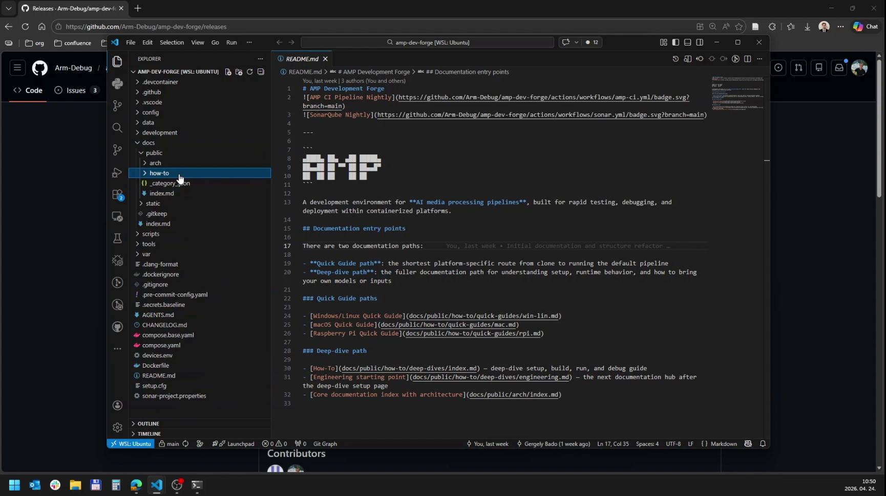
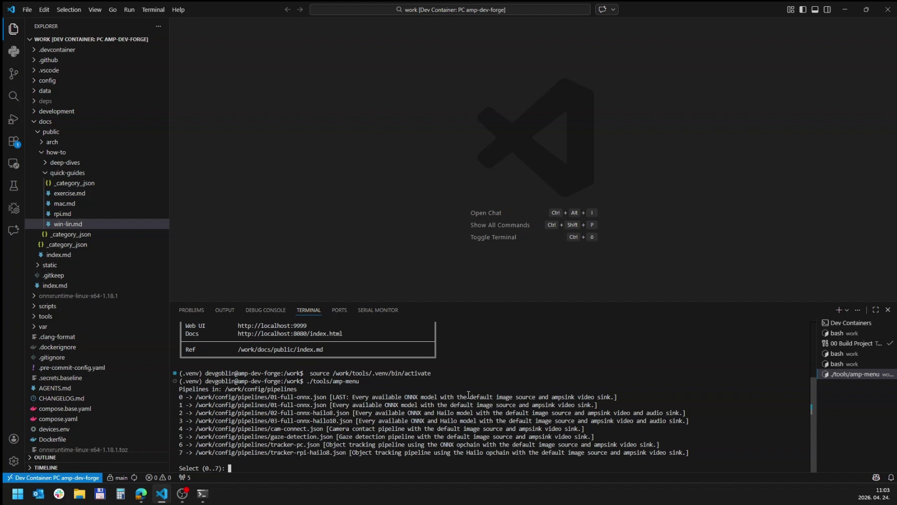
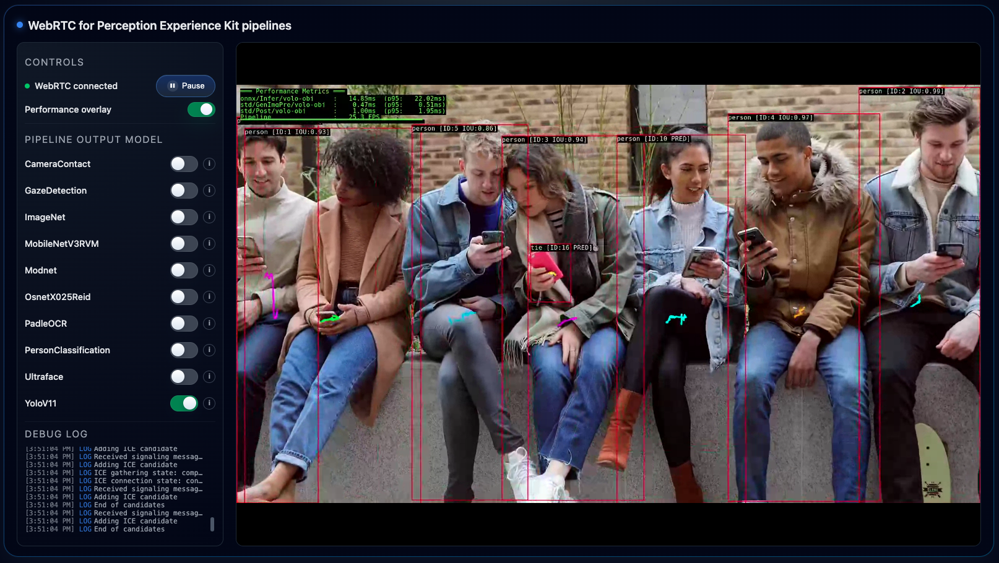

# Windows Quick Start

Use this guide on a Windows computer. AMP runs inside WSL and a VS Code Dev Container, so most commands are Linux commands even though your computer is Windows.

## What You Need

Install these before you start:

- WSL with Ubuntu installed.
- Git inside WSL.
- Docker Desktop with WSL integration enabled.
- Visual Studio Code on Windows.
- VS Code **Dev Containers** extension.
- Optional: VS Code **WSL** extension.

If you want to use a USB camera from WSL later, you may also need USBIPD or WSL USB Manager. You do not need that for the first still-image run.

## 1. Open Ubuntu/WSL

Open the Windows Start menu and start **Ubuntu**.

All commands in this section run in the **WSL shell**.

Check that basic tools are available:

```bash
git --version
docker --version
docker compose version
code --version
```

If `docker` does not work, open Docker Desktop and confirm that WSL integration is enabled for your Ubuntu distribution.

## 2. Get The Repository

The easiest path is HTTPS cloning. It does not require an SSH key.

Run in the **WSL shell**:

```bash
git clone https://github.com/Arm-Debug/amp-dev-forge.git
cd amp-dev-forge
```

If you must clone with SSH, set up your key first: [GitHub SSH Key Setup](github-ssh-key.md).

Expected result: you are in the `amp-dev-forge` folder in WSL.

## 3. Open The Project In VS Code

Run in the **WSL shell**, from the `amp-dev-forge` folder:

```bash
code .
```

VS Code should open the folder through WSL. In VS Code:



1. Open the Command Palette with `Ctrl+Shift+P`.
2. Run **Dev Containers: Reopen in Container**.


3. Choose **PC amp-dev-forge**.


4. Wait for the container to finish building.

Expected result: VS Code reloads and the lower-left corner shows that you are inside the Dev Container.


## 4. Build AMP

Open a new terminal in VS Code after the container is ready. This terminal is the **Docker shell**.

Run in the **Docker shell**:

```bash
./scripts/build-elements.sh debug false
```

You can also use the VS Code task:

1. Open the Command Palette with `Ctrl+Shift+P`.
2. Run **Tasks: Run Task**.
3. Choose **00 Build Project**.


Expected result: the build finishes without errors and `tools/amp-menu` exists.

## 5. Start The First Pipeline

Run in the **Docker shell**:

```bash
./tools/amp-menu 01-full-onnx
```

You can also use the VS Code task **00 Run project and select pipeline** and choose `01-full-onnx`.



Expected result: the pipeline starts and keeps running in the terminal. Leave that terminal open.

Some GStreamer or browser-connection warnings can appear while the pipeline is running. Treat the browser result in the next step as the real success check.

## 6. Open The Web UI

Open Microsoft Edge or Firefox on Windows:

```text
http://localhost:9999
```

In the **AI Models** panel, enable one model first. For example, enable `yolov11` or `mobilenetv2`.



Expected result: the page shows the AMP view and enabling a model produces an overlay or result. The default quick-start pipeline uses a still image, so the image may not look like a live camera feed.

## 7. Stop And Run Again

To stop AMP, click the terminal that is running the pipeline and press `Ctrl+C`.

To run the last selected pipeline again, run in the **Docker shell**:

```bash
./tools/amp-menu -l
```

## If Something Fails

- If VS Code says the container cannot start, make sure Docker Desktop is open.
- If Docker commands fail in WSL, check Docker Desktop WSL integration.
- If the browser opens but no result appears, enable a model in the **AI Models** panel.
- If you see a path error, confirm that VS Code opened the repository folder, not its parent folder.
